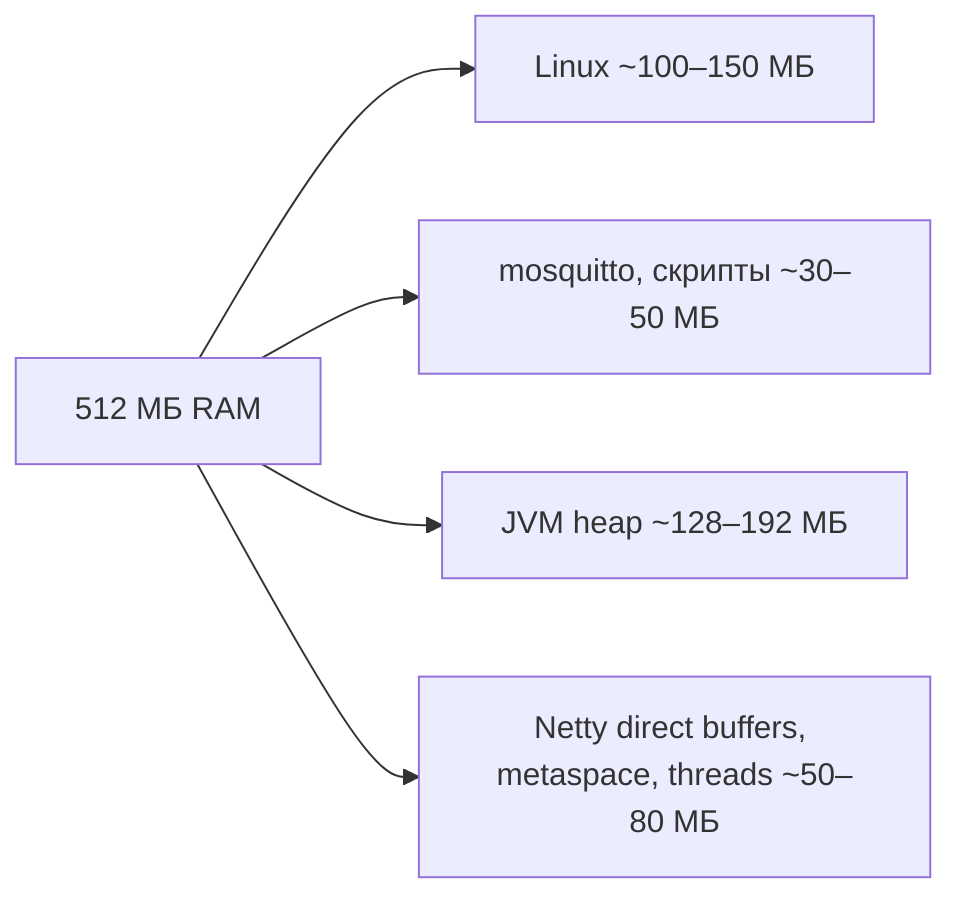
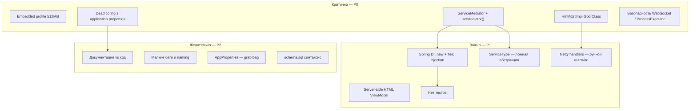
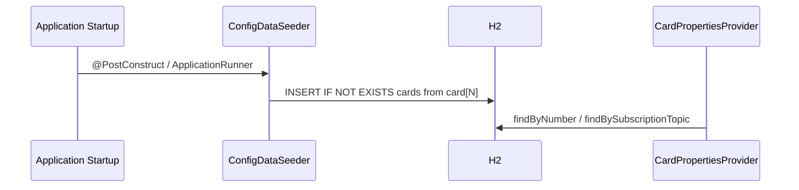
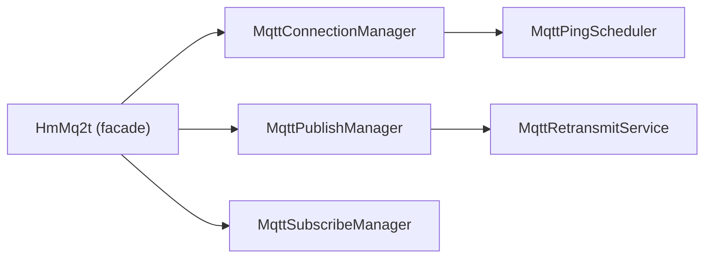
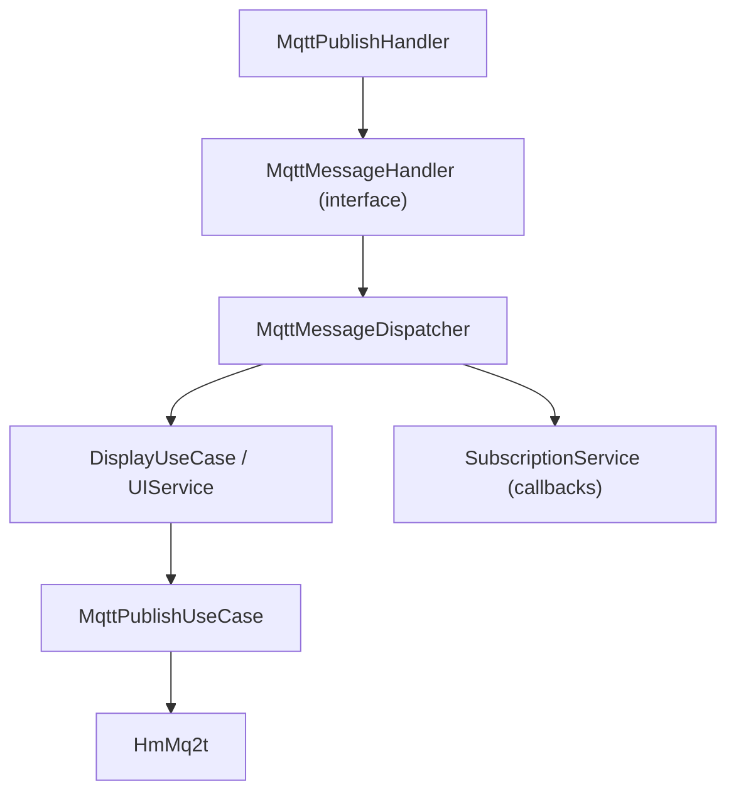
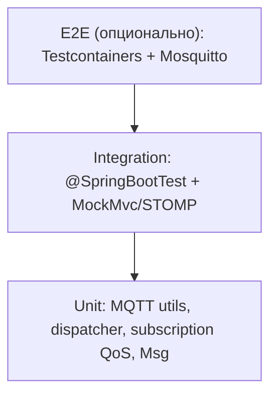
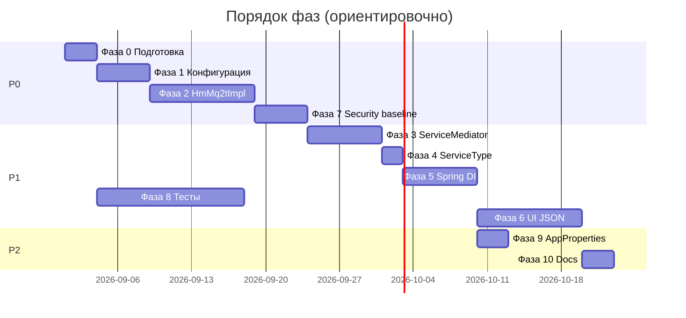

# План устранения архитектурного долга homeMq2t

## Контекст

Документ фиксирует план работ по устранению архитектурного долга, выявленного при аудите кодовой базы (август 2026). План дополняет существующие документы:

- [`plans/architecture.md`](architecture.md) — текущая архитектура (карта для ИИ и разработчиков)
- [`plans/Roadmap.md`](Roadmap.md) — функциональные улучшения (MQTT, UI, планировщик)
- [`plans/refactoring-remove-command-component.md`](refactoring-remove-command-component.md) — удаление Command/Component (частично выполнено или в процессе)

**Цель:** снизить связанность, повысить тестируемость и предсказуемость системы без «большого переписывания» за один раз.

**Принцип:** маленькие инкрементальные PR, каждый фиксирует работоспособность приложения.

**Целевая платформа:** Orange Pi Zero (512 МБ RAM, ARM). План **обязан** учитывать лимит памяти — см. раздел ниже.

---

## Ограничения Orange Pi Zero (512 МБ) — cross-cutting

> **Примечание:** в первой версии плана (2026-08-29) embedded-ограничения не были явно зафиксированы. Этот раздел добавлен как обязательный фильтр для всех фаз.

### Бюджет памяти (ориентир)



| Ресурс | Типичное потребление | Риск при текущем коде |
|--------|---------------------|------------------------|
| Spring Boot + JPA + H2 | 80–120 МБ heap | Средний |
| `processExecutor` 10/20 + queue 600 | до 20 потоков | **Высокий** — стеки потоков |
| `mq2tTaskScheduler` pool 10 | 10 потоков | **Высокий** |
| `max-bytes-in-message = 8092000` (~8 МБ) | один MQTT payload | **Критичный** — OOM |
| Webcam Base64 в JSON | 100–500 КБ на сообщение | **Высокий** при нескольких карточках |
| Jsoup server-side HTML | DOM-копии строк | Средний |
| H2 `AUTO_SERVER=TRUE` + console | доп. процессы/порты | Средний |
| `spring.jpa.show-sql=true` | лишний I/O и строки | Низкий |

### Принципы для embedded (обязательны при рефакторинге)

1. **Не добавлять тяжёлые зависимости** — Spring Security допустим в minimal config; SPA-фреймворки (Vue/React) — **нет**.
2. **Profile `embedded`** (или `prod`) — отдельный `application-embedded.properties` для Orange Pi.
3. **Меньше потоков** — embedded: async pool 2/4, scheduler 2; не 10/20.
4. **Лимиты payload** — `max-bytes-in-message` ≤ 512 КБ (webcam) или ≤ 64 КБ (текст); streaming не держать весь payload в heap.
5. **JVM flags** — документировать запуск: `-Xms64m -Xmx192m -XX:+UseSerialGC` (или G1 с `MaxGCPauseMillis` и маленьким heap).
6. **Тесты и CI** — Testcontainers/Moquette только на dev-машине, не на плате.
7. **Миграция UI на JSON** (Фаза 6) — **снижает** нагрузку на сервер (убрать Jsoup из hot path), клиент рендерит в браузере на другом устройстве.

### Задачи embedded-профиля (включить в Фазу 0 или отдельный PR — P0)

| # | Задача | Файлы |
|---|--------|-------|
| E.1 | Создать `application-embedded.properties` | `resources/` |
| E.2 | Уменьшить пулы: async 2/4 queue 50, scheduler 2 | `AppAnnotationConfig` или properties |
| E.3 | `max-bytes-in-message=524288` (512 КБ) для embedded | `application-embedded.properties` |
| E.4 | Отключить H2 console, `show-sql=false` | profile embedded |
| E.5 | Документировать systemd unit + JVM opts | `readme.md` или `docs/embedded-run.md` |
| E.6 | Убрать diagnostic dump окружения из hot path (`getAppProperty`) | `AppAnnotationConfig` |
| E.7 | Мониторинг: лог heap при старте + warn при `OutOfMemoryError` | `App.java` или listener |

Пример `application-embedded.properties`:

```properties
# Orange Pi Zero — 512 MB RAM
spring.profiles.active=embedded
spring.h2.console.enabled=false
spring.jpa.show-sql=false
max-bytes-in-message=524288
# Пулы — через @ConfigurationProperties (после Фазы 5)
async.core-pool-size=2
async.max-pool-size=4
async.queue-capacity=50
scheduler.pool-size=2
logging.level.root=WARN
logging.level.ru.maxeltr.homeMq2t=INFO
```

### Что в плане **пересмотрено** с учётом 512 МБ

| Было | Стало |
|------|-------|
| Фаза 6 — опционально SPA | **Только vanilla JS** на клиенте; без bundler и node_modules на плате |
| Spring Security P0 для prod | P0 для **сетевого** prod; на OPi Zero за NAT — basic auth или IP bind, **без** тяжёлых filter chains |
| Virtual Threads (Roadmap) | **Отложить** на embedded — экономят OS threads, но увеличивают heap pressure; оценить после замеров |
| Увеличение test coverage | Тесты только на dev-PC; на плате — `./gradlew` не запускать |

### Критерий «влезает в 512 МБ»

- [ ] Старт с profile `embedded`: RSS процесса Java **< 250 МБ** в idle (измерить `ps aux` или `/proc/PID/status`)
- [ ] 9 карточек + 1 webcam publish не вызывает OOM 30 минут
- [ ] MQTT reconnect после обрыва — без роста heap > 20 МБ (утечки)

---

## Сводная карта проблем



---

## Приоритеты

| Приоритет | Смысл | Когда |
|-----------|-------|-------|
| **P0** | Блокирует надёжность, безопасность или вводит в заблуждение | Первые 2–3 итерации |
| **P1** | Снижает стоимость изменений, улучшает поддержку | После P0 |
| **P2** | Качество, консистентность, DX | По мере возможности |

---

## Фаза 0: Подготовка (1 PR)

**Цель:** зафиксировать baseline и не ломать регрессии при рефакторинге.

### Задачи

1. **Smoke-тест контекста Spring**
   - Добавить `@SpringBootTest` с поднятием контекста (без MQTT-брокера: mock/stub `HmMq2t` или `@MockBean`).
   - Файл: `app/src/test/java/ru/maxeltr/homeMq2t/AppContextTest.java`

2. **Unit-тесты критичных pure-функций**
   - `MqttUtils.convertToMqttQos`
   - `AppUtils.safeParseInt`
   - `SubscriptionServiceImpl` — агрегация QoS (можно без Spring)

3. **Embedded profile (Orange Pi Zero)** — задачи E.1–E.7 из раздела «Ограничения Orange Pi Zero».
4. **Чеклист ручной проверки** (в конце этого документа) — использовать после каждой фазы.

### Критерий готовности

- `./gradlew test` проходит (на dev-машине)
- Smoke-тест контекста зелёный
- Profile `embedded` стартует с уменьшенными пулами и лимитом MQTT payload

---

## Фаза 1: Конфигурация — один источник правды (P0)

**Проблема:** `application.properties` содержит `card[N]`, `dashboard[N].cards`, но runtime читает **H2** через `CardRepository` / `CardPropertiesProviderImpl`. Конфиг в properties — мёртвый и вводит в заблуждение.

### Решение (выбрать один вариант)

#### Вариант A (рекомендуется): Properties → seed в БД при первом запуске



- Создать `ConfigDataSeeder` (или `CardConfigImporter`):
  - Читает `card[N].*` и `dashboard[N].*` из `Environment`
  - Импортирует в `card_settings` / `dashboard_settings` **только если записи ещё нет**
- После импорта runtime и UI работают только через БД

#### Вариант B: Удалить card[N] из properties

- Оставить только infrastructure-настройки (порт, MQTT timeouts, пути шаблонов)
- Карточки создавать через UI или `schema.sql` / SQL-миграции
- Обновить README

### Задачи

| # | Задача | Файлы |
|---|--------|-------|
| 1.1 | Реализовать выбранный вариант (A или B) | `Config/ConfigDataSeeder.java`, `application.properties` |
| 1.2 | Удалить или пометить deprecated неиспользуемые ключи | `application.properties` |
| 1.3 | Исправить `schema.sql` (лишний `VALUES` после `INSERT ... SELECT`) | `schema.sql` |
| 1.4 | Переименовать `CardPropertiesProvider` → `CardConfigProvider` (или `CardRepositoryFacade`) | интерфейс + impl + все `@Qualifier` |
| 1.5 | Обновить [`plans/architecture.md`](architecture.md) §4.1, §4.10 | `architecture.md` |

### Критерий готовности

- Изменение `card[0].subscription.topic` в properties **либо** импортируется в БД, **либо** ключ удалён и документирован
- Подписки берутся из БД, поведение предсказуемо после чистой установки

---

## Фаза 2: Разделение HmMq2tImpl (P0)

**Проблема:** ~875 строк, connect + reconnect + subscribe + publish + ping + retransmit в одном классе. TODO в коде уже указывает направление.

### Целевая декомпозиция



### Задачи (инкрементально, 3–4 PR)

| # | PR | Что вынести | Новые классы |
|---|-----|-------------|--------------|
| 2.1 | Connection | connect, disconnect, reconnect, channel lifecycle | `MqttConnectionManager` |
| 2.2 | Publish | publish, packet id, QoS flow | `MqttPublishManager` |
| 2.3 | Subscribe | subscribe, unsubscribe | `MqttSubscribeManager` |
| 2.4 | Ping + Retransmit | keepalive, `RetransmitTask` | `MqttPingScheduler`, `MqttRetransmitService` |

### Правила рефакторинга

- `HmMq2tImpl` остаётся **тонким фасадом**, делегирует в менеджеры
- `CommandLineRunner` (auto-connect) — только в connection-слое
- Публичный интерфейс `HmMq2t` **не менять** без крайней необходимости (минимальный diff для callers)
- Каждый PR — `./gradlew test` + ручной connect/publish/subscribe

### Критерий готовности

- `HmMq2tImpl` < 200 строк
- Нет дублирования логики reconnect между handler'ами и impl

---

## Фаза 3: Устранение ServiceMediator как service locator (P0 → P1)

**Проблема:** ручной `setMediator()` в `@PostConstruct`, циклические зависимости, `@Lazy //TODO`.

```java
// Текущее (анти-паттерн)
public void setMediator() {
    uiService.setMediator(this);
    hmMq2t.setMediator(this);
    mqttChannelInitializer.setMediator(this);
    mqttManager.setMediator(this);
}
```

### Целевая модель



### Задачи

| # | Задача | Детали |
|---|--------|--------|
| 3.1 | Ввести `MqttInboundMessageHandler` | Единая точка входа для PUBLISH из Netty |
| 3.2 | Ввести `MqttOutboundPublisher` | Обёртка над `HmMq2t.publish`, без зависимости UI → Mediator |
| 3.3 | Убрать `setMediator()` из `HmMq2t`, `MqttManager`, `MqttChannelInitializer` | Constructor injection |
| 3.4 | Упростить или удалить `ServiceType` | См. Фаза 4 |
| 3.5 | Убрать `@Lazy` из `SubscriptionServiceImpl`, `DisplayManagerImpl` | После разрыва циклов |
| 3.6 | Сузить `ServiceMediator` | Оставить только orchestration shutdown/connect **или** заменить на 2–3 узких сервиса |

### Альтернатива (меньший diff)

- Spring Application Events: `MqttMessageReceivedEvent` → `@EventListener` в UI-слое
- Netty handler публикует event, не знает про `UIService`

### Критерий готовности

- Нет метода `setMediator()` в production-коде
- Нет `@Lazy //TODO` для обхода циклов
- Граф зависимостей — DAG (направленный ациклический)

---

## Фаза 4: ServiceType и маршрутизация сообщений (P1)

**Проблема:** enum с единственным значением `UI`, цикл `ServiceType.values()`, method references на `ServiceMediatorImpl`.

### Задачи

| # | Задача |
|---|--------|
| 4.1 | Заменить enum на `TopicRouter` / `MqttMessageDispatcher` с явной регистрацией handlers |
| 4.2 | Маршрутизация по топику: `cardPropertiesProvider.getCardNumbersByTopic(topic)` → `uiService.display()` |
| 4.3 | Удалить `ServiceType.java` после миграции |
| 4.4 | Unit-тест: топик → список card numbers → вызов display |

### Критерий готовности

- Нет `ServiceType.values()` loop для одного handler'а
- Добавление нового типа обработки = регистрация bean'а, а не правка enum

---

## Фаза 5: Spring DI — идиоматичная конфигурация (P1)

**Проблема:** `AppAnnotationConfig` создаёт всё через `new XxxImpl()` + field `@Autowired`.

### Задачи

| # | Задача | Подход |
|---|--------|--------|
| 5.1 | `@Component` / `@Service` на impl-классах | Постепенно, пакет за пакетом |
| 5.2 | Constructor injection вместо field injection | Начать с `Service`, `Controller` |
| 5.3 | Упростить `AppAnnotationConfig` | Оставить только `@Bean` для инфраструктуры (schedulers, ObjectMapper) |
| 5.4 | Убрать diagnostic dump из `getAppProperty()` | Перенести в `@EventListener ApplicationReadyEvent` или убрать |
| 5.5 | Netty handlers — Spring `@Component` + `@ChannelHandler.Sharable` где возможно | Или factory bean вместо `autowireBean` в `MqttChannelInitializer` |

### Порядок миграции пакетов

1. `Controller/`
2. `Service/UI/`
3. `Service/` (Subscription, ProcessExecutor)
4. `Mqtt/` (после Фазы 2)
5. `Config/` providers

### Критерий готовности

- Новые классы — только constructor injection
- `AppAnnotationConfig` < 100 строк (без dump окружения)

---

## Фаза 6: UI — от server-side HTML к JSON + client render (P1, **выгода для 512 МБ**)

**Проблема:** `ViewModel` собирает HTML на сервере (Jsoup), шлёт разметку по STOMP. Смешение presentation и domain.

**Embedded-выгода:** перенос рендеринга на браузер (ПК/телефон в LAN) **освобождает heap на Orange Pi** — Jsoup и большие HTML-строки исчезают из hot path MQTT → UI.

### Поэтапная стратегия (не big bang)

#### Этап 6.1 — JSON over STOMP (минимальный шаг) — **приоритет для OPi Zero**

- `OutputUIController` отправляет **JSON DTO** (`CardStateDto`, `DashboardDto`), а не HTML
- `Static/app.js` рендерит карточки на клиенте (шаблоны в JS или `<template>` — **без** npm/webpack на плате)
- `ViewModel.getHtml()` — deprecated, удалить после миграции
- Для webcam: клиент получает Base64/URL, сервер **не** парсит и не пересобирает HTML

#### Этап 6.2 — REST для CRUD настроек

- `GET/POST/DELETE /api/cards`, `/api/mqtt-settings`
- STOMP только для realtime updates (`/topic/card/{id}`)

#### Этап 6.3 — **не планируется на embedded**

- Vue/React/Svelte — **исключены** для Orange Pi Zero (dev-машина может использовать отдельный UI-проект)

### Задачи этапа 6.1

| # | Задача | Файлы |
|---|--------|-------|
| 6.1.1 | DTO: `CardViewDto`, `DashboardViewDto` | `Model/Dto/` |
| 6.1.2 | `DisplayManagerImpl` → формирует DTO, не HTML | `DisplayManagerImpl.java` |
| 6.1.3 | Обновить `app.js` — рендер по DTO | `Static/app.js` |
| 6.1.4 | Удалить Jsoup из hot path display (оставить для settings forms или убрать полностью) | `ViewModel.java`, `CardImpl.java` |

### Критерий готовности этапа 6.1

- Входящие MQTT-сообщения → JSON в STOMP → клиент обновляет DOM
- Настройки карточек работают (HTML forms можно мигрировать позже)

---

## Фаза 7: Безопасность (P0 для prod, P1 для home lab)

**Проблема:** открытый WebSocket, `shutdownApp` без auth, произвольный `ProcessExecutor`, H2 console.

### Задачи

| # | Задача | Приоритет |
|---|--------|-----------|
| 7.1 | Spring Security: minimal auth (in-memory user, 1–2 filter) на HTTP + WebSocket | P0 (сеть); на OPi за NAT — bind `127.0.0.1` или firewall |
| 7.2 | Отключить `spring.h2.console.enabled` по profile `prod` | P0 |
| 7.3 | Whitelist для `ProcessExecutor`: только разрешённые пути/команды из конфига | P0 |
| 7.4 | `shutdownApp` — только для authenticated admin role | P0 |
| 7.5 | Разделить `publish` и `launch` в контроллере | P1 |
| 7.6 | TLS для MQTT (см. [`Roadmap.md`](Roadmap.md)) | P1 |

### Текущий баг coupling

```java
// InputUIControllerImpl.publish — всегда два действия
uiService.publish(msg.build());
uiService.launch(msg.build());
```

**Исправление:** отдельные STOMP endpoints `/publish` и `/launch`, или flag в `Msg`.

### ProcessExecutor

- Парсить arguments через `String.split` или список, не один аргумент
- Таймаут — вынести в `application.properties`
- Логировать команду audit-уровнем

### Критерий готовности

- Profile `prod`: нет anonymous access к `/app/*` и H2 console
- Local task вне whitelist → отказ с логом

---

## Фаза 8: Тестовое покрытие (P1)

### Пирамида тестов



### Минимальный набор (Must have)

| Область | Тест | Тип |
|---------|------|-----|
| `ServiceMediator.handleMessage` / dispatcher | JSON → display, plain text fallback | Unit |
| `SubscriptionServiceImpl` | merge QoS, multiple subscribers | Unit |
| `MqttAckMediator` | promise tracking | Unit |
| `ConfigDataSeeder` | import card[N] → DB | Integration |
| STOMP `/app/publish` | mock HmMq2t | Integration |
| Context load | beans wiring | Smoke |

### Задачи

| # | Задача |
|---|--------|
| 8.1 | Test fixtures: `CardEntity`, `Msg` builders |
| 8.2 | `@MockBean HmMq2t` для UI/integration тестов |
| 8.3 | Embedded broker (Moquette) или Testcontainers — опционально, Фаза 8+ |

### Критерий готовности

- ≥ 20 meaningful tests
- CI (если появится) — `./gradlew test` обязателен

---

## Фаза 9: AppProperties и naming (P2)

**Проблема:** `AppProperties` — MQTT getters + startup tasks + subscriptions + repositories.

### Задачи

| # | Разделить на | Ответственность |
|---|--------------|-----------------|
| 9.1 | `MqttSettingsProvider` | host, port, credentials из БД |
| 9.2 | `StartupTaskProvider` | startup tasks (уже интерфейс есть) |
| 9.3 | `SubscriptionConfigProvider` | `getAllSubscriptions()` — или метод в `CardConfigProvider` |
| 9.4 | Удалить дублирование между `AppProperties.getAllSubscriptions()` и `CardPropertiesProvider.getAllSubscriptions()` | один источник |

### Прочие naming fixes

| Было | Стало |
|------|-------|
| `CardPropertiesProvider` | `CardConfigProvider` |
| `MqttManager` / `publishManager` | единое имя `MqttPublishService` |
| `appProperties` qualifier для card config | `cardConfigProvider` |

---

## Фаза 10: Документация и dead code (P2)

### Задачи

| # | Задача | Файл |
|---|--------|------|
| 10.1 | README: убрать plugins/ClassLoader (не реализовано) | `readme.md` |
| 10.2 | README: актуализировать persistence (H2) | `readme.md` |
| 10.3 | README: единый источник конфигурации карточек | `readme.md` |
| 10.4 | Обновить Mermaid в architecture.md после Фаз 2–5 | `architecture.md` |
| 10.5 | Удалить закомментированный код в `WebSocketConfig`, `MqttChannelInitializer` | Java files |
| 10.6 | Реализовать или удалить `deleteMqttSettings` | `UIServiceImpl.java` |
| 10.7 | Связать этот план с Roadmap (ссылки, не дублировать MQTT features) | `Roadmap.md` |

---

## Рекомендуемый порядок выполнения



> Фаза 8 (тесты) идёт **параллельно** с остальными с первого дня — каждый PR добавляет тесты к затронутому коду.

---

## Чеклист ручной проверки (после каждой фазы)

- [ ] `./gradlew clean build` — успех
- [ ] Приложение стартует на порту `local-server-port`
- [ ] Web UI открывается (`/Static/index.html` или корень)
- [ ] STOMP connect к `/mq2tClientDashboard`
- [ ] MQTT connect к брокеру (если настроен)
- [ ] Карточки отображают данные с топика
- [ ] Publish из карточки доходит до брокера
- [ ] Local task (если настроен) — stdout в карточке
- [ ] Save/delete card settings — персистентность после restart
- [ ] Disconnect / shutdown — без зависания (нет deadlock)

---

## Метрики «долг погашен»

| Метрика | Сейчас | Цель |
|---------|--------|------|
| `HmMq2tImpl` строк | ~875 | < 200 |
| `setMediator()` вызовов | 4+ компонентов | 0 |
| `@Lazy //TODO` | ≥ 2 | 0 |
| Unit/Integration tests | ~1 пустой | ≥ 20 |
| Dead keys в application.properties | card[0..N] | 0 или seed documented |
| Server-side HTML в display path | 100% | 0% (после Фазы 6.1) |
| Anonymous STOMP (profile prod) | да | нет |

---

## Риски и mitigation

| Риск | Mitigation |
|------|------------|
| Рефакторинг MQTT сломает prod | Фаза 0 + инкрементальные PR + ручной чеклист |
| UI JSON migration сломает dashboard | Feature flag: `ui.render-mode=html\|json` на переходный период |
| Spring DI migration — циклы | Фаза 3 перед массовым `@Component` |
| Scope creep | Не смешивать с Roadmap features (TLS, Cron) в одном PR |

---

## Связь с другими планами

| План | Отношение |
|------|-----------|
| [`refactoring-remove-command-component.md`](refactoring-remove-command-component.md) | **Prerequisite** — завершить до Фазы 3 |
| [`msg-impl-record-refactor.md`](msg-impl-record-refactor.md) | Можно параллельно Фазе 8 |
| [`subscribe-refactor.md`](subscribe-refactor.md) | Координировать с Фазой 2.3 |
| [`Roadmap.md`](Roadmap.md) | Функциональность после стабилизации архитектуры |

---

*Документ создан: 2026-08-29. Обновлять по мере закрытия фаз (ставить ✅ в заголовке фазы).*
