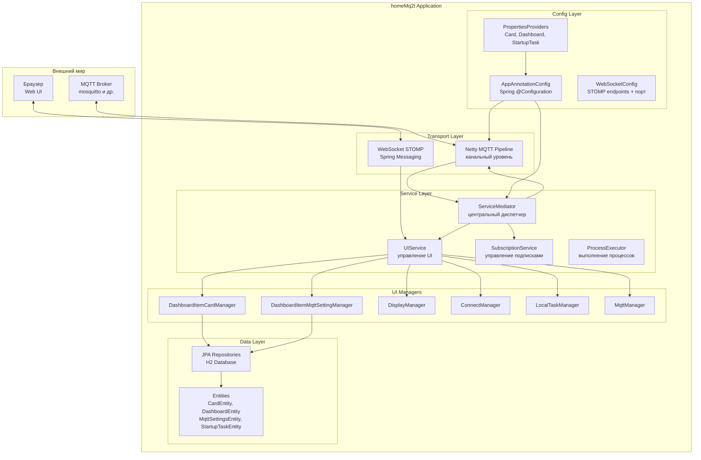
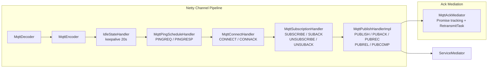
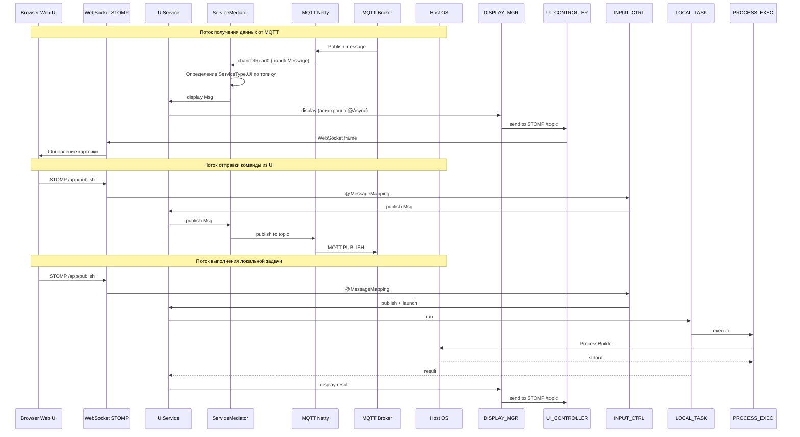
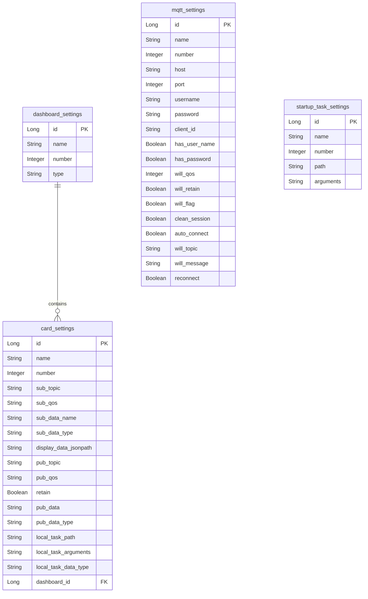
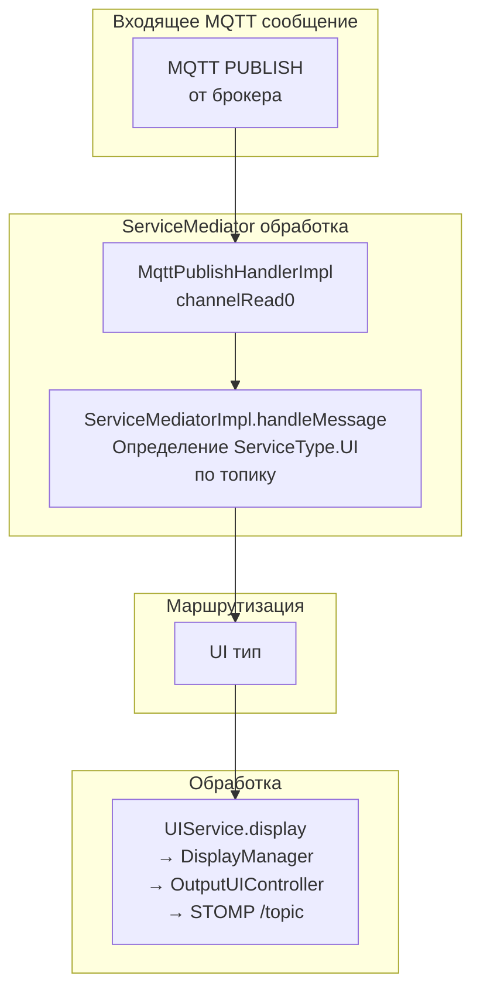

# Архитектура приложения homeMq2t

## Обзор

**homeMq2t** — это Spring Boot приложение на базе Netty, которое реализует MQTT 3.1.1 клиент для обмена сообщениями между устройствами. Приложение предоставляет веб-интерфейс через WebSocket + STOMP, позволяет выполнять команды на хост-системе и отображать данные в карточках дашборда.

---

## 1. Схема высокоуровневой архитектуры



---

## 2. Схема MQTT Netty Pipeline



---

## 3. Схема потока данных (Data Flow)



---

## 4. Компонентная архитектура по слоям

### 4.1 Слой конфигурации (Config)

| Компонент | Назначение |
|-----------|-----------|
| [`AppAnnotationConfig`](app/src/main/java/ru/maxeltr/homeMq2t/Config/AppAnnotationConfig.java) | Главный Spring @Configuration класс. Создаёт бины: HmMq2t, ServiceMediator, UIService, SubscriptionService, все DashboardItemManager'ы, пулы потоков, ObjectMapper, ProcessExecutor, AppShutdownManager |
| [`WebSocketConfig`](app/src/main/java/ru/maxeltr/homeMq2t/Config/WebSocketConfig.java) | Настройка STOMP WebSocket: endpoint `/mq2tClientDashboard`, simple broker `/topic`, префикс `/app`. Также реализует `WebServerFactoryCustomizer` для настройки порта (`local-server-port`, по умолчанию 8028) |
| [`AppProperties`](app/src/main/java/ru/maxeltr/homeMq2t/Config/AppProperties.java) | Загрузка общих настроек из application.properties и БД. Реализует `StartupTaskPropertiesProvider`. Методы `getMqttSettings()` / `getEmptyMqttSettings()` возвращают `Optional<ViewModel<MqttSettingsEntity>>`. Содержит методы доступа к настройкам MQTT (host, port, username, password, client-id, will, clean-session) |
| [`CardPropertiesProvider`](app/src/main/java/ru/maxeltr/homeMq2t/Config/CardPropertiesProvider.java) / [`Impl`](app/src/main/java/ru/maxeltr/homeMq2t/Config/CardPropertiesProviderImpl.java) | Настройки карточек: топики подписки/публикации, QoS, JSONPath, типы данных, локальные задачи |
| [`DashboardPropertiesProvider`](app/src/main/java/ru/maxeltr/homeMq2t/Config/DashboardPropertiesProvider.java) / [`Impl`](app/src/main/java/ru/maxeltr/homeMq2t/Config/DashboardPropertiesProviderImpl.java) | Настройки дашбордов: получение дашборда по номеру, стартового дашборда, списка дашбордов для карточек |
| [`StartupTaskPropertiesProvider`](app/src/main/java/ru/maxeltr/homeMq2t/Config/StartupTaskPropertiesProvider.java) | Интерфейс для задач, выполняемых при старте приложения. Реализуется `AppProperties` |
| [`ImmutableObjectMapper`](app/src/main/java/ru/maxeltr/homeMq2t/Config/ImmutableObjectMapper.java) | Jackson ObjectMapper с защитой от изменений конфигурации (запрет регистрации модулей, изменения настроек сериализации) |
| [`MediaTypes`](app/src/main/java/ru/maxeltr/homeMq2t/Config/MediaTypes.java) | Enum констант MIME-типов: APPLICATION_JSON, TEXT_PLAIN, IMAGE_JPEG_BASE64, TEXT_HTML_BASE64. Содержит метод `asStringList()` |

### 4.2 Транспортный слой — MQTT over Netty

| Компонент | Назначение |
|-----------|-----------|
| [`HmMq2t`](app/src/main/java/ru/maxeltr/homeMq2t/Mqtt/HmMq2t.java) / [`HmMq2tImpl`](app/src/main/java/ru/maxeltr/homeMq2t/Mqtt/HmMq2tImpl.java) | Главный интерфейс MQTT клиента: connect, reconnect, disconnect, subscribe, unsubscribe, publish. Реализует `CommandLineRunner` для авто-подключения при старте. Содержит встроенный `RetransmitTask` для повторной отправки неподтверждённых сообщений |
| [`MqttChannelInitializer`](app/src/main/java/ru/maxeltr/homeMq2t/Mqtt/MqttChannelInitializer.java) | Netty ChannelInitializer: собирает pipeline из MqttDecoder, MqttEncoder, IdleStateHandler, PingScheduleHandler, ConnectHandler, SubscriptionHandler, PublishHandler. Реализует `ApplicationContextAware` для ручного autowiring handler'ов |
| [`MqttConnectHandler`](app/src/main/java/ru/maxeltr/homeMq2t/Mqtt/MqttConnectHandler.java) | Обработка CONNECT/CONNACK. Отправляет CONNECT сообщение при активации канала (`channelActive`) |
| [`MqttSubscriptionHandler`](app/src/main/java/ru/maxeltr/homeMq2t/Mqtt/MqttSubscriptionHandler.java) | Обработка SUBACK/UNSUBACK |
| [`MqttPublishHandler`](app/src/main/java/ru/maxeltr/homeMq2t/Mqtt/MqttPublishHandler.java) | Интерфейс с методом `handlerAdded` |
| [`MqttPublishHandlerImpl`](app/src/main/java/ru/maxeltr/homeMq2t/Mqtt/MqttPublishHandlerImpl.java) | Обработка входящих PUBLISH сообщений и подтверждений (PUBACK, PUBREC, PUBREL, PUBCOMP). Маршрутизирует входящие PUBLISH в ServiceMediator. Реализует QoS 0, 1, 2 для входящих сообщений |
| [`MqttPingScheduleHandler`](app/src/main/java/ru/maxeltr/homeMq2t/Mqtt/MqttPingScheduleHandler.java) | Периодическая отправка PINGREQ для keepalive через `ThreadPoolTaskScheduler`. Также обрабатывает входящие PINGREQ (отвечает PINGRESP) и PINGRESP. При таймауте ping-ответа инициирует reconnect или disconnect |
| [`MqttAckMediator`](app/src/main/java/ru/maxeltr/homeMq2t/Mqtt/MqttAckMediator.java) / [`Impl`](app/src/main/java/ru/maxeltr/homeMq2t/Mqtt/MqttAckMediatorImpl.java) | Отслеживание Promise для подтверждений (ACK). Хранит future и сообщения по packetId. Реализует `Iterable<MqttMessage>` для RetransmitTask |
| [`MqttUtils`](app/src/main/java/ru/maxeltr/homeMq2t/Mqtt/MqttUtils.java) | Утилиты для работы с MQTT сообщениями: конвертация QoS из строки в `MqttQoS`, константа `MQTT_SUBACK_FAILURE` |

### 4.3 Слой сервисов (Service)

#### 4.3.1 Центральный диспетчер

| Компонент | Назначение |
|-----------|-----------|
| [`ServiceMediator`](app/src/main/java/ru/maxeltr/homeMq2t/Service/ServiceMediator.java) / [`ServiceMediatorImpl`](app/src/main/java/ru/maxeltr/homeMq2t/Service/ServiceMediatorImpl.java) | **Центральный диспетчер приложения.** Принимает входящие MQTT сообщения, определяет тип сервиса по топику через `ServiceType` enum (только UI) и делегирует обработку. Также выполняет startup-задачи при инициализации через `ProcessExecutor`. Управляет подключением/отключением/shutdown |
| [`ServiceType`](app/src/main/java/ru/maxeltr/homeMq2t/Service/ServiceType.java) | Enum с единственным типом сервиса: `UI`. Содержит ссылку на метод-обработчик и метод получения номеров карточек по топику. Включает функциональный интерфейс `TriConsumer` |

#### 4.3.2 UI Service

| Компонент | Назначение |
|-----------|-----------|
| [`UIService`](app/src/main/java/ru/maxeltr/homeMq2t/Service/UI/UIService.java) / [`UIServiceImpl`](app/src/main/java/ru/maxeltr/homeMq2t/Service/UI/UIServiceImpl.java) | Оркестрирует все UI-операции: connect/disconnect, отображение дашбордов, карточек, настроек MQTT, публикация сообщений, запуск локальных задач. Метод `display()` аннотирован `@Async("processExecutor")` для асинхронного отображения |
| [`ConnectManager`](app/src/main/java/ru/maxeltr/homeMq2t/Service/UI/ConnectManager.java) / [`Impl`](app/src/main/java/ru/maxeltr/homeMq2t/Service/UI/ConnectManagerImpl.java) | Управление подключением к MQTT брокеру. После успешного подключения вызывает `subscriptionService.subscribeFromConfig()` |
| [`DisplayManager`](app/src/main/java/ru/maxeltr/homeMq2t/Service/UI/DisplayManager.java) / [`DisplayManagerImpl`](app/src/main/java/ru/maxeltr/homeMq2t/Service/UI/DisplayManagerImpl.java) | Форматирование данных для отображения: применение JSONPath, санитизация HTML через Jsoup, установка MIME-типа. Отправляет результат через `OutputUIController` в STOMP `/topic` |
| [`DashboardItemManager`](app/src/main/java/ru/maxeltr/homeMq2t/Service/UI/DashboardItemManager.java) | Интерфейс для менеджеров элементов дашборда: getItem, getItemsByDashboard, saveItem, deleteItem |
| [`DashboardItemCardManagerImpl`](app/src/main/java/ru/maxeltr/homeMq2t/Service/UI/DashboardItemCardManagerImpl.java) | Управление карточками на дашборде: получение, сохранение, удаление. Использует `CardPropertiesProvider` и `DashboardPropertiesProvider`. При сохранении/удалении обновляет подписки через `MqttManager.updateSubscription()` |
| [`DashboardItemMqttSettingManagerImpl`](app/src/main/java/ru/maxeltr/homeMq2t/Service/UI/DashboardItemMqttSettingManagerImpl.java) | Управление настройками MQTT на дашборде. Использует `AppProperties` для получения/сохранения `MqttSettingsEntity` |
| [`MqttManager`](app/src/main/java/ru/maxeltr/homeMq2t/Service/UI/MqttManager.java) / [`MqttManagerImpl`](app/src/main/java/ru/maxeltr/homeMq2t/Service/UI/MqttManagerImpl.java) | Публикация сообщений в MQTT из UI. Также управляет обновлением подписок при изменении карточек через `SubscriptionService` |
| [`LocalTaskManager`](app/src/main/java/ru/maxeltr/homeMq2t/Service/UI/LocalTaskManager.java) / [`LocalTaskManagerImpl`](app/src/main/java/ru/maxeltr/homeMq2t/Service/UI/LocalTaskManagerImpl.java) | Запуск локальных задач/скриптов из карточки через `ProcessExecutor` |
| [`UIJsonFormatter`](app/src/main/java/ru/maxeltr/homeMq2t/Service/UI/UIJsonFormatter.java) / [`Base64HtmlJsonFormatterImpl`](app/src/main/java/ru/maxeltr/homeMq2t/Service/UI/Base64HtmlJsonFormatterImpl.java) | Форматирование JSON для отображения: парсинг через JsonPath, создание JSON с типом, Base64-кодирование HTML с префиксом статуса |
| [`HtmlSanitizer`](app/src/main/java/ru/maxeltr/homeMq2t/Service/UI/HtmlSanitizer.java) / [`HtmlSanitizerImpl`](app/src/main/java/ru/maxeltr/homeMq2t/Service/UI/HtmlSanitizerImpl.java) | Санитизация HTML через Jsoup `Safelist.basic()` для защиты XSS |

#### 4.3.3 Process Executor

| Компонент | Назначение |
|-----------|-----------|
| [`ProcessExecutor`](app/src/main/java/ru/maxeltr/homeMq2t/Service/ProcessExecutor.java) / [`ProcessExecutorImpl`](app/src/main/java/ru/maxeltr/homeMq2t/Service/ProcessExecutorImpl.java) | Запуск внешних процессов через `ProcessBuilder`, захват stdout с таймаутом 5 секунд. Используется `LocalTaskManagerImpl` для выполнения локальных задач и `ServiceMediatorImpl` для startup-задач |

#### 4.3.4 Subscription Service

| Компонент | Назначение |
|-----------|-----------|
| [`SubscriptionService`](app/src/main/java/ru/maxeltr/homeMq2t/Service/SubscriptionService.java) / [`SubscriptionServiceImpl`](app/src/main/java/ru/maxeltr/homeMq2t/Service/SubscriptionServiceImpl.java) | Управление MQTT подписками. Подписывается на топики из конфигурации карточек. Отслеживает статус подписок через `ConcurrentHashMap<String, Subscription>`. Поддерживает множественных подписчиков на один топик с автоматическим выбором максимального QoS. Обрабатывает SUBACK/UNSUBACK через Promise |

### 4.4 Слой контроллеров (Controller)

| Компонент | Назначение |
|-----------|-----------|
| [`InputUIController`](app/src/main/java/ru/maxeltr/homeMq2t/Controller/InputUIController.java) / [`InputUIControllerImpl`](app/src/main/java/ru/maxeltr/homeMq2t/Controller/InputUIControllerImpl.java) | Spring @Controller. Принимает STOMP сообщения от браузера: connect, disconnect, shutdownApp, publish, getMqttSettings, getCardSettings, saveCard, saveMqttSettings, deleteCard, deleteMqttSettings, displayCardDashboard |
| [`OutputUIController`](app/src/main/java/ru/maxeltr/homeMq2t/Controller/OutputUIController.java) / [`OutputUIControllerImpl`](app/src/main/java/ru/maxeltr/homeMq2t/Controller/OutputUIControllerImpl.java) | Отправка данных в браузер через STOMP `/topic` с заголовком `card` |

### 4.5 Слой модели (Model)

| Компонент | Назначение |
|-----------|-----------|
| [`Msg`](app/src/main/java/ru/maxeltr/homeMq2t/Model/Msg.java) / [`MsgImpl`](app/src/main/java/ru/maxeltr/homeMq2t/Model/MsgImpl.java) | Иммутабельное сообщение с полями: id, type, data, timestamp. Использует Builder pattern (внутренний класс `MsgBuilder`). Десериализуется Jackson через `Msg.Builder` |
| [`Dashboard`](app/src/main/java/ru/maxeltr/homeMq2t/Model/Dashboard.java) | Интерфейс дашборда: getNumber, getName, getHtml, getItems |
| [`DashboardImpl`](app/src/main/java/ru/maxeltr/homeMq2t/Model/DashboardImpl.java) | `ViewModel<DashboardEntity>` — ViewModel для дашборда. Встраивает HTML карточек в элемент `dashboard-cards` |
| [`DashboardType`](app/src/main/java/ru/maxeltr/homeMq2t/Model/DashboardType.java) | Enum с единственным типом: `CARD("card")` |
| [`ViewModel`](app/src/main/java/ru/maxeltr/homeMq2t/Model/ViewModel.java) | Абстрактный generic-класс `ViewModel<T extends BaseEntity>`. Параметр `T` определяет тип сущности. Загружает HTML из classpath ресурсов через Jsoup. Содержит абстрактный метод `configureTemplate()` |
| [`CardImpl`](app/src/main/java/ru/maxeltr/homeMq2t/Model/CardImpl.java) | `ViewModel<CardEntity>` — ViewModel для карточки. Настраивает id, заголовок, текст, кнопки |
| [`CardSettingsImpl`](app/src/main/java/ru/maxeltr/homeMq2t/Model/CardSettingsImpl.java) | `ViewModel<CardEntity>` — ViewModel для настроек карточки. Содержит `List<ViewModel<DashboardEntity>>` для выбора дашборда и `List<String>` mediaTypes |
| [`MqttSettingsImpl`](app/src/main/java/ru/maxeltr/homeMq2t/Model/MqttSettingsImpl.java) | `ViewModel<MqttSettingsEntity>` — ViewModel для настроек MQTT |
| [`Status`](app/src/main/java/ru/maxeltr/homeMq2t/Model/Status.java) | Enum статусов: OK, FAIL, UNKNOWN |

### 4.6 Слой сущностей БД (Entity)

| Компонент | Назначение |
|-----------|-----------|
| [`BaseEntity`](app/src/main/java/ru/maxeltr/homeMq2t/Entity/BaseEntity.java) | Абстрактный базовый класс: name, number. Содержит константы `JSON_FIELD_ID` и `JSON_FIELD_NAME` |
| [`DashboardEntity`](app/src/main/java/ru/maxeltr/homeMq2t/Entity/DashboardEntity.java) | JPA Entity для таблицы `dashboard_settings`. Generic `DashboardEntity<T extends BaseEntity>`. Содержит тип дашборда (`DashboardType`) и список элементов (`CardEntity`) |
| [`CardEntity`](app/src/main/java/ru/maxeltr/homeMq2t/Entity/CardEntity.java) | JPA Entity для таблицы `card_settings`. Реализует `HasSubscription`. Содержит: топики подписки/публикации, QoS, JSONPath, retain, данные публикации, локальную задачу, ссылку на `DashboardEntity` |
| [`MqttSettingsEntity`](app/src/main/java/ru/maxeltr/homeMq2t/Entity/MqttSettingsEntity.java) | JPA Entity для таблицы `mqtt_settings`. Содержит: host, port, username, password, client-id, will, clean-session, autoConnect, reconnect |
| [`StartupTaskEntity`](app/src/main/java/ru/maxeltr/homeMq2t/Entity/StartupTaskEntity.java) | JPA Entity для таблицы `startup_task_settings`. Содержит: path, arguments |
| [`HasSubscription`](app/src/main/java/ru/maxeltr/homeMq2t/Entity/HasSubscription.java) | Интерфейс для сущностей, имеющих MQTT подписку: `getSubscriptionTopic()`, `getSubscriptionQos()` |

### 4.7 Слой репозиториев (Repository)

| Компонент | Назначение |
|-----------|-----------|
| [`CardRepository`](app/src/main/java/ru/maxeltr/homeMq2t/Repository/CardRepository.java) | JPA Repository для CardEntity. Дополнительные методы: findByNumber, findByName, findBySubscriptionTopic, findByDashboardNumber |
| [`DashboardRepository`](app/src/main/java/ru/maxeltr/homeMq2t/Repository/DashboardRepository.java) | JPA Repository для DashboardEntity. Generic `DashboardRepository<T extends BaseEntity>`. Дополнительные методы: findByType, findByNumber, findByName |
| [`MqttSettingsRepository`](app/src/main/java/ru/maxeltr/homeMq2t/Repository/MqttSettingsRepository.java) | JPA Repository для MqttSettingsEntity. Дополнительный метод: findByName |
| [`StartupTaskRepository`](app/src/main/java/ru/maxeltr/homeMq2t/Repository/StartupTaskRepository.java) | JPA Repository для StartupTaskEntity. Дополнительные методы: findByNumber, findByName |

### 4.8 WebSocket слой

| Компонент | Назначение |
|-----------|-----------|
| [`Mq2tSubProtocolWebSocketHandler`](app/src/main/java/ru/maxeltr/homeMq2t/Websocket/Mq2tSubProtocolWebSocketHandler.java) | Расширение `SubProtocolWebSocketHandler`. Регистрирует WebSocket сессии в `SessionHandler`. **Не используется** — закомментирован в `WebSocketConfig` |
| [`SessionHandler`](app/src/main/java/ru/maxeltr/homeMq2t/Websocket/SessionHandler.java) | Управление WebSocket сессиями через `ConcurrentHashMap`. **Не используется** — закомментирован в `WebSocketConfig` |

### 4.9 Статические ресурсы (Frontend)

| Файл | Назначение |
|------|-----------|
| [`index.html`](app/src/main/resources/Static/index.html) | Главная страница |
| [`dashboard.html`](app/src/main/resources/Static/dashboard.html) | Шаблон дашборда |
| [`card.html`](app/src/main/resources/Static/card.html) | Шаблон карточки |
| [`cardSettings.html`](app/src/main/resources/Static/cardSettings.html) | Шаблон настроек карточки |
| [`mqttSettings.html`](app/src/main/resources/Static/mqttSettings.html) | Шаблон настроек MQTT |
| [`app.js`](app/src/main/resources/Static/app.js) | Клиентский JavaScript: STOMP подключение, обработка событий |
| [`main.css`](app/src/main/resources/Static/main.css) | Стили |

### 4.10 Конфигурационные файлы

| Файл | Назначение |
|------|-----------|
| [`application.properties`](app/src/main/resources/application.properties) | Основные настройки приложения |
| [`schema.sql`](app/src/main/resources/schema.sql) | DDL для H2 database |
| [`strings.properties`](app/src/main/resources/strings.properties) | Локализация строк |

### 4.11 Утилиты

| Компонент | Назначение |
|-----------|-----------|
| [`AppUtils`](app/src/main/java/ru/maxeltr/homeMq2t/Utils/AppUtils.java) | Утилитный класс: безопасный парсинг Integer из строки (`safeParseInt`) |
| [`AppShutdownManager`](app/src/main/java/ru/maxeltr/homeMq2t/AppShutdownManager.java) | Управление завершением приложения через `SpringApplication.exit()` |

---

## 5. Схема базы данных



---

## 6. Ключевые архитектурные решения

1. **Netty для MQTT** — полный контроль над MQTT протоколом на уровне каналов Netty, без использования сторонних MQTT библиотек
2. **ServiceMediator как оркестратор** — все входящие MQTT сообщения проходят через единый диспетчер, который определяет тип сервиса по топику
3. **Immutable сообщения** — `Msg` использует Builder pattern для иммутабельной передачи данных
4. **Хранение в H2** — встроенная БД для настроек карточек, дашбордов, MQTT и startup-задач
5. **Web UI через STOMP** — реальное время через WebSocket с Simple Broker
6. **Асинхронное отображение** — `@Async("processExecutor")` для неблокирующей отправки данных в UI
7. **Санитизация HTML** — защита от XSS через Jsoup `Safelist.basic()`
8. **Generic ViewModel\<T\>** — `ViewModel<T extends BaseEntity>` обеспечивает типобезопасную работу с различными сущностями (CardEntity, DashboardEntity, MqttSettingsEntity). Все реализации (CardImpl, DashboardImpl, MqttSettingsImpl) явно параметризуют T соответствующим типом сущности
9. **Promise-based ACK tracking** — `MqttAckMediator` отслеживает подтверждения MQTT сообщений через Netty Promise с поддержкой ретрансмиссии
10. **Subscription aggregation** — `SubscriptionServiceImpl` объединяет подписки на один топик от нескольких сущностей, выбирая максимальный QoS
11. **ImmutableObjectMapper** — защищённый ObjectMapper, запрещающий регистрацию дополнительных модулей Jackson после создания
12. **Авто-подключение** — `HmMq2tImpl` реализует `CommandLineRunner` для автоматического подключения к MQTT брокеру при старте (если `autoConnect=true`)

---

## 7. Поток сообщений (Message Flow)



---

## 8. Диаграмма зависимостей (Gradle)

```
homeMq2t (root)
└── app (Spring Boot приложение)
    ├── spring-boot-starter
    ├── spring-boot-starter-websocket
    ├── spring-boot-starter-data-jpa
    ├── netty-all (4.2.6.Final)
    ├── h2database (H2)
    ├── jackson (ObjectMapper)
    ├── json-path (Jayway)
    ├── jsoup (HTML sanitizer)
    ├── commons-lang3
    ├── webjars: bootstrap, jquery, bootstrap-icons, sockjs, stomp, dompurify
    └── webjars-locator-core