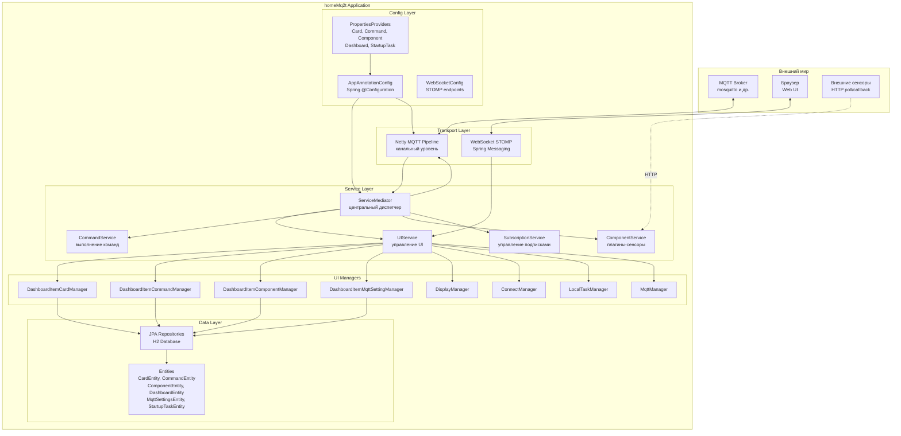
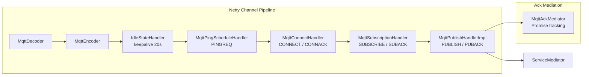
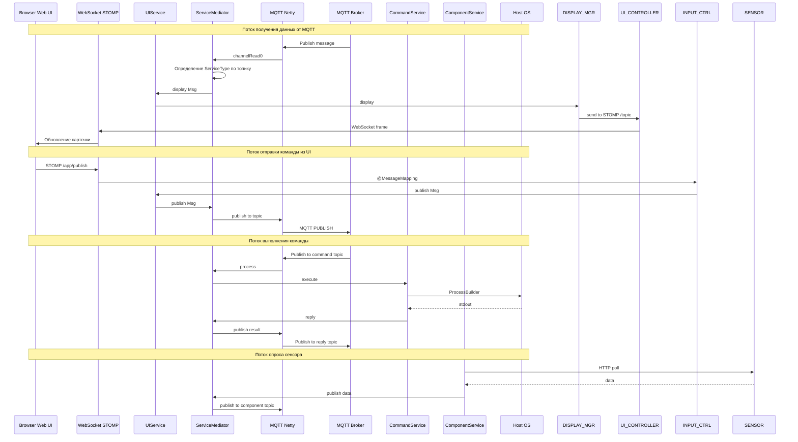
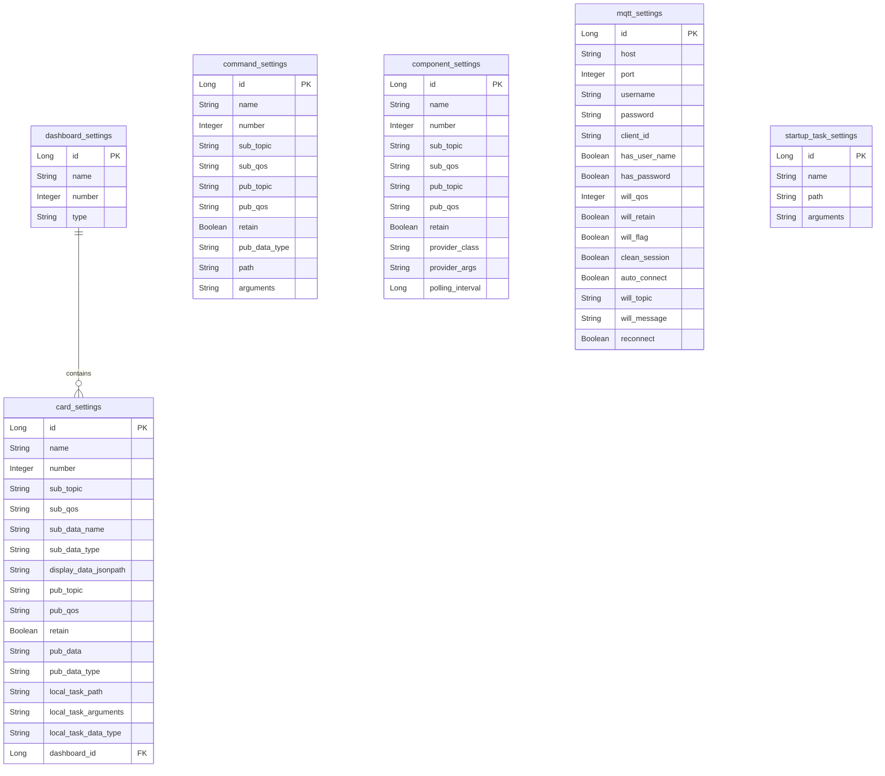
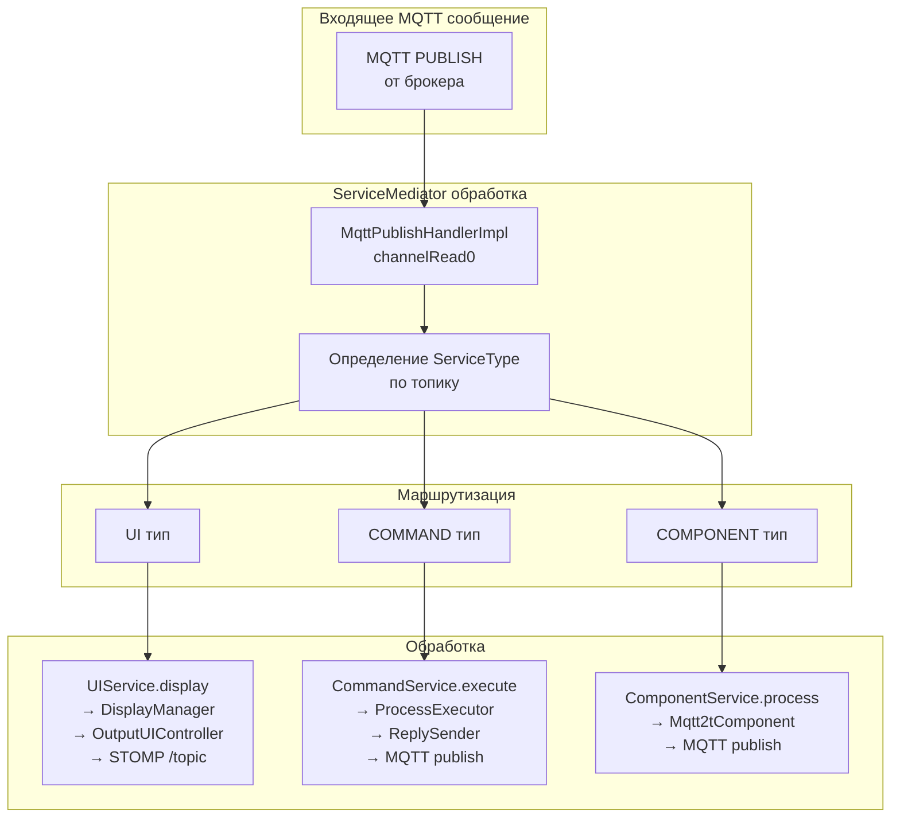

# Архитектура приложения homeMq2t

## Обзор

**homeMq2t** — это Spring Boot приложение на базе Netty, которое реализует MQTT 3.1.1 клиент/сервер для обмена сообщениями между устройствами. Приложение предоставляет веб-интерфейс через WebSocket + STOMP, позволяет выполнять команды на хост-системе, опрашивать сенсоры через плагины и отображать данные в карточках дашборда.

---

## 1. Схема высокоуровневой архитектуры



---

## 2. Схема MQTT Netty Pipeline



---

## 3. Схема потока данных (Data Flow)



---

## 4. Компонентная архитектура по слоям

### 4.1 Слой конфигурации (Config)

| Компонент | Назначение |
|-----------|-----------|
| [`AppAnnotationConfig`](app/src/main/java/ru/maxeltr/homeMq2t/Config/AppAnnotationConfig.java) | Главный Spring @Configuration класс. Создаёт бины: HmMq2t, ServiceMediator, UIService, CommandService, ComponentService, SubscriptionService, все DashboardItemManager'ы, пулы потоков, ObjectMapper |
| [`WebSocketConfig`](app/src/main/java/ru/maxeltr/homeMq2t/Config/WebSocketConfig.java) | Настройка STOMP WebSocket: endpoint `/mq2tClientDashboard`, simple broker `/topic`, префикс `/app` |
| [`AppProperties`](app/src/main/java/ru/maxeltr/homeMq2t/Config/AppProperties.java) | Загрузка общих настроек из application.properties |
| [`CardPropertiesProvider`](app/src/main/java/ru/maxeltr/homeMq2t/Config/CardPropertiesProvider.java) / [`Impl`](app/src/main/java/ru/maxeltr/homeMq2t/Config/CardPropertiesProviderImpl.java) | Настройки карточек: топики подписки/публикации, QoS, JSONPath, типы данных |
| [`CommandPropertiesProvider`](app/src/main/java/ru/maxeltr/homeMq2t/Config/CommandPropertiesProvider.java) / [`Impl`](app/src/main/java/ru/maxeltr/homeMq2t/Config/CommandPropertiesProviderImpl.java) | Настройки команд: путь к исполняемому файлу, аргументы, топики |
| [`ComponentPropertiesProvider`](app/src/main/java/ru/maxeltr/homeMq2t/Config/ComponentPropertiesProvider.java) / [`Impl`](app/src/main/java/ru/maxeltr/homeMq2t/Config/ComponentPropertiesProviderImpl.java) | Настройки компонентов-сенсоров: класс провайдера, аргументы, периодичность |
| [`DashboardPropertiesProvider`](app/src/main/java/ru/maxeltr/homeMq2t/Config/DashboardPropertiesProvider.java) / [`Impl`](app/src/main/java/ru/maxeltr/homeMq2t/Config/DashboardPropertiesProviderImpl.java) | Настройки дашбордов |
| [`StartupTaskPropertiesProvider`](app/src/main/java/ru/maxeltr/homeMq2t/Config/StartupTaskPropertiesProvider.java) | Задачи, выполняемые при старте приложения |
| [`ImmutableObjectMapper`](app/src/main/java/ru/maxeltr/homeMq2t/Config/ImmutableObjectMapper.java) | Jackson ObjectMapper для immutable объектов |
| [`MediaTypes`](app/src/main/java/ru/maxeltr/homeMq2t/Config/MediaTypes.java) | Константы MIME-типов |

### 4.2 Транспортный слой — MQTT over Netty

| Компонент | Назначение |
|-----------|-----------|
| [`HmMq2t`](app/src/main/java/ru/maxeltr/homeMq2t/Mqtt/HmMq2t.java) / [`HmMq2tImpl`](app/src/main/java/ru/maxeltr/homeMq2t/Mqtt/HmMq2tImpl.java) | Главный интерфейс MQTT клиента: connect, reconnect, disconnect, subscribe, unsubscribe, publish |
| [`MqttChannelInitializer`](app/src/main/java/ru/maxeltr/homeMq2t/Mqtt/MqttChannelInitializer.java) | Netty ChannelInitializer: собирает pipeline из MqttDecoder, MqttEncoder, IdleStateHandler, PingScheduleHandler, ConnectHandler, SubscriptionHandler, PublishHandler |
| [`MqttConnectHandler`](app/src/main/java/ru/maxeltr/homeMq2t/Mqtt/MqttConnectHandler.java) | Обработка CONNECT/CONNACK |
| [`MqttSubscriptionHandler`](app/src/main/java/ru/maxeltr/homeMq2t/Mqtt/MqttSubscriptionHandler.java) | Обработка SUBSCRIBE/SUBACK/UNSUBSCRIBE |
| [`MqttPublishHandlerImpl`](app/src/main/java/ru/maxeltr/homeMq2t/Mqtt/MqttPublishHandlerImpl.java) | Обработка входящих PUBLISH сообщений. Маршрутизирует в ServiceMediator по топику |
| [`MqttPingScheduleHandler`](app/src/main/java/ru/maxeltr/homeMq2t/Mqtt/MqttPingScheduleHandler.java) | Периодическая отправка PINGREQ для keepalive |
| [`MqttAckMediator`](app/src/main/java/ru/maxeltr/homeMq2t/Mqtt/MqttAckMediator.java) / [`Impl`](app/src/main/java/ru/maxeltr/homeMq2t/Mqtt/MqttAckMediatorImpl.java) | Отслеживание Promise для подтверждений (ACK) |
| [`MqttUtils`](app/src/main/java/ru/maxeltr/homeMq2t/Mqtt/MqttUtils.java) | Утилиты для работы с MQTT сообщениями |

### 4.3 Слой сервисов (Service)

#### 4.3.1 Центральный диспетчер

| Компонент | Назначение |
|-----------|-----------|
| [`ServiceMediator`](app/src/main/java/ru/maxeltr/homeMq2t/Service/ServiceMediator.java) / [`ServiceMediatorImpl`](app/src/main/java/ru/maxeltr/homeMq2t/Service/ServiceMediatorImpl.java) | **Центральный диспетчер приложения.** Принимает входящие MQTT сообщения, определяет тип сервиса по топику через `ServiceType` enum и делегирует обработку: UI (карточки), Command (команды), Component (сенсоры). Также выполняет startup-задачи при инициализации |
| [`ServiceType`](app/src/main/java/ru/maxeltr/homeMq2t/Service/ServiceType.java) | Enum с типами сервисов: `UI`, `COMMAND`, `COMPONENT`. Каждый тип содержит ссылку на метод-обработчик и метод получения номеров по топику |

#### 4.3.2 UI Service

| Компонент | Назначение |
|-----------|-----------|
| [`UIService`](app/src/main/java/ru/maxeltr/homeMq2t/Service/UI/UIService.java) / [`UIServiceImpl`](app/src/main/java/ru/maxeltr/homeMq2t/Service/UI/UIServiceImpl.java) | Оркестрирует все UI-операции: connect/disconnect, отображение дашбордов, карточек, команд, компонентов, настроек MQTT, публикация сообщений, запуск локальных задач |
| [`ConnectManager`](app/src/main/java/ru/maxeltr/homeMq2t/Service/UI/ConnectManager.java) / [`Impl`](app/src/main/java/ru/maxeltr/homeMq2t/Service/UI/ConnectManagerImpl.java) | Управление подключением к MQTT брокеру |
| [`DisplayManager`](app/src/main/java/ru/maxeltr/homeMq2t/Service/UI/DisplayManager.java) / [`DisplayManagerImpl`](app/src/main/java/ru/maxeltr/homeMq2t/Service/UI/DisplayManagerImpl.java) | Форматирование данных для отображения: применение JSONPath, санитизация HTML, установка MIME-типа |
| [`DashboardItemManager`](app/src/main/java/ru/maxeltr/homeMq2t/Service/UI/DashboardItemManager.java) | Интерфейс для менеджеров элементов дашборда |
| [`DashboardItemCardManagerImpl`](app/src/main/java/ru/maxeltr/homeMq2t/Service/UI/DashboardItemCardManagerImpl.java) | Управление карточками на дашборде |
| [`DashboardItemCommandManagerImpl`](app/src/main/java/ru/maxeltr/homeMq2t/Service/UI/DashboardItemCommandManagerImpl.java) | Управление командами на дашборде |
| [`DashboardItemComponentManagerImpl`](app/src/main/java/ru/maxeltr/homeMq2t/Service/UI/DashboardItemComponentManagerImpl.java) | Управление компонентами на дашборде |
| [`DashboardItemMqttSettingManagerImpl`](app/src/main/java/ru/maxeltr/homeMq2t/Service/UI/DashboardItemMqttSettingManagerImpl.java) | Управление настройками MQTT на дашборде |
| [`MqttManager`](app/src/main/java/ru/maxeltr/homeMq2t/Service/UI/MqttManager.java) / [`MqttManagerImpl`](app/src/main/java/ru/maxeltr/homeMq2t/Service/UI/MqttManagerImpl.java) | Публикация сообщений в MQTT из UI |
| [`LocalTaskManager`](app/src/main/java/ru/maxeltr/homeMq2t/Service/UI/LocalTaskManager.java) / [`LocalTaskManagerImpl`](app/src/main/java/ru/maxeltr/homeMq2t/Service/UI/LocalTaskManagerImpl.java) | Запуск локальных задач/скриптов из карточки |
| [`UIJsonFormatter`](app/src/main/java/ru/maxeltr/homeMq2t/Service/UI/UIJsonFormatter.java) / [`Base64HtmlJsonFormatterImpl`](app/src/main/java/ru/maxeltr/homeMq2t/Service/UI/Base64HtmlJsonFormatterImpl.java) | Форматирование JSON для отображения, поддержка Base64 |
| [`HtmlSanitizer`](app/src/main/java/ru/maxeltr/homeMq2t/Service/UI/HtmlSanitizer.java) / [`HtmlSanitizerImpl`](app/src/main/java/ru/maxeltr/homeMq2t/Service/UI/HtmlSanitizerImpl.java) | Санитизация HTML через Jsoup для защиты XSS |

#### 4.3.3 Command Service

| Компонент | Назначение |
|-----------|-----------|
| [`CommandService`](app/src/main/java/ru/maxeltr/homeMq2t/Service/Command/CommandService.java) / [`CommandServiceImpl`](app/src/main/java/ru/maxeltr/homeMq2t/Service/Command/CommandServiceImpl.java) | Асинхронное выполнение команд на хост-системе. Получает команду из MQTT, парсит, выполняет через ProcessExecutor, отправляет результат через ReplySender |
| [`CommandParser`](app/src/main/java/ru/maxeltr/homeMq2t/Service/Command/CommandParser.java) / [`CommandParserImpl`](app/src/main/java/ru/maxeltr/homeMq2t/Service/Command/CommandParserImpl.java) | Парсинг входящего MQTT сообщения для извлечения имени команды |
| [`ProcessExecutor`](app/src/main/java/ru/maxeltr/homeMq2t/Service/Command/ProcessExecutor.java) / [`ProcessExecutorImpl`](app/src/main/java/ru/maxeltr/homeMq2t/Service/Command/ProcessExecutorImpl.java) | Запуск внешних процессов через `ProcessBuilder`, захват stdout |
| [`ReplySender`](app/src/main/java/ru/maxeltr/homeMq2t/Service/Command/ReplySender.java) / [`ReplySenderImpl`](app/src/main/java/ru/maxeltr/homeMq2t/Service/Command/ReplySenderImpl.java) | Отправка результата выполнения команды в MQTT топик |

#### 4.3.4 Component Service

| Компонент | Назначение |
|-----------|-----------|
| [`ComponentService`](app/src/main/java/ru/maxeltr/homeMq2t/Service/ComponentService.java) / [`ComponentServiceImpl`](app/src/main/java/ru/maxeltr/homeMq2t/Service/ComponentServiceImpl.java) | Управление плагинными компонентами (сенсорами). Загружает `Mq2tComponent` через ServiceLoader, инициализирует pollable и callback компоненты, публикует их данные в MQTT |

#### 4.3.5 Subscription Service

| Компонент | Назначение |
|-----------|-----------|
| [`SubscriptionService`](app/src/main/java/ru/maxeltr/homeMq2t/Service/SubscriptionService.java) / [`SubscriptionServiceImpl`](app/src/main/java/ru/maxeltr/homeMq2t/Service/SubscriptionServiceImpl.java) | Управление MQTT подписками. Подписывается на топики из конфигурации карточек, команд и компонентов. Отслеживает статус подписок, переподключается при необходимости |

### 4.4 Слой контроллеров (Controller)

| Компонент | Назначение |
|-----------|-----------|
| [`InputUIController`](app/src/main/java/ru/maxeltr/homeMq2t/Controller/InputUIController.java) / [`InputUIControllerImpl`](app/src/main/java/ru/maxeltr/homeMq2t/Controller/InputUIControllerImpl.java) | Spring @Controller. Принимает STOMP сообщения от браузера: connect, disconnect, publish, get/save настроек карточек, команд, компонентов, MQTT |
| [`OutputUIController`](app/src/main/java/ru/maxeltr/homeMq2t/Controller/OutputUIController.java) / [`OutputUIControllerImpl`](app/src/main/java/ru/maxeltr/homeMq2t/Controller/OutputUIControllerImpl.java) | Отправка данных в браузер через STOMP `/topic` |

### 4.5 Слой модели (Model)

| Компонент | Назначение |
|-----------|-----------|
| [`Msg`](app/src/main/java/ru/maxeltr/homeMq2t/Model/Msg.java) / [`MsgImpl`](app/src/main/java/ru/maxeltr/homeMq2t/Model/MsgImpl.java) | Иммутабельное сообщение с полями: id, type, data, timestamp. Использует Builder pattern |
| [`Dashboard`](app/src/main/java/ru/maxeltr/homeMq2t/Model/Dashboard.java) / [`DashboardImpl`](app/src/main/java/ru/maxeltr/homeMq2t/Model/DashboardImpl.java) | Модель дашборда: номер, имя, HTML, список ViewModel |
| [`DashboardType`](app/src/main/java/ru/maxeltr/homeMq2t/Model/DashboardType.java) | Enum типов дашборда |
| [`ViewModel`](app/src/main/java/ru/maxeltr/homeMq2t/Model/ViewModel.java) | Абстрактная модель представления для элементов дашборда. Загружает HTML из файлов Static/ |
| [`CardImpl`](app/src/main/java/ru/maxeltr/homeMq2t/Model/CardImpl.java) | ViewModel для карточки |
| [`CommandImpl`](app/src/main/java/ru/maxeltr/homeMq2t/Model/CommandImpl.java) | ViewModel для команды |
| [`ComponentImpl`](app/src/main/java/ru/maxeltr/homeMq2t/Model/ComponentImpl.java) | ViewModel для компонента |
| [`MqttSettingsImpl`](app/src/main/java/ru/maxeltr/homeMq2t/Model/MqttSettingsImpl.java) | ViewModel для настроек MQTT |
| [`CardSettingsImpl`](app/src/main/java/ru/maxeltr/homeMq2t/Model/CardSettingsImpl.java) | ViewModel для настроек карточки |
| [`CommandSettingsImpl`](app/src/main/java/ru/maxeltr/homeMq2t/Model/CommandSettingsImpl.java) | ViewModel для настроек команды |
| [`ComponentSettingsImpl`](app/src/main/java/ru/maxeltr/homeMq2t/Model/ComponentSettingsImpl.java) | ViewModel для настроек компонента |
| [`Status`](app/src/main/java/ru/maxeltr/homeMq2t/Model/Status.java) | Enum статусов |

### 4.6 Слой сущностей БД (Entity)

| Компонент | Назначение |
|-----------|-----------|
| [`BaseEntity`](app/src/main/java/ru/maxeltr/homeMq2t/Entity/BaseEntity.java) | Абстрактный базовый класс: name, number |
| [`DashboardEntity`](app/src/main/java/ru/maxeltr/homeMq2t/Entity/DashboardEntity.java) | JPA Entity для таблицы `dashboard_settings`. Содержит тип дашборда и список элементов (CardEntity) |
| [`CardEntity`](app/src/main/java/ru/maxeltr/homeMq2t/Entity/CardEntity.java) | JPA Entity для карточки: топики, QoS, JSONPath, retain, локальная задача |
| [`CommandEntity`](app/src/main/java/ru/maxeltr/homeMq2t/Entity/CommandEntity.java) | JPA Entity для команды: путь, аргументы, топики |
| [`ComponentEntity`](app/src/main/java/ru/maxeltr/homeMq2t/Entity/ComponentEntity.java) | JPA Entity для компонента: класс провайдера, аргументы, периодичность |
| [`MqttSettingsEntity`](app/src/main/java/ru/maxeltr/homeMq2t/Entity/MqttSettingsEntity.java) | JPA Entity для настроек MQTT: host, port, username, password, client-id, will, clean-session |
| [`StartupTaskEntity`](app/src/main/java/ru/maxeltr/homeMq2t/Entity/StartupTaskEntity.java) | JPA Entity для задач автозапуска |
| [`HasSubscription`](app/src/main/java/ru/maxeltr/homeMq2t/Entity/HasSubscription.java) | Интерфейс для сущностей, имеющих MQTT подписку |

### 4.7 Слой репозиториев (Repository)

| Компонент | Назначение |
|-----------|-----------|
| [`CardRepository`](app/src/main/java/ru/maxeltr/homeMq2t/Repository/CardRepository.java) | JPA Repository для CardEntity |
| [`CommandRepository`](app/src/main/java/ru/maxeltr/homeMq2t/Repository/CommandRepository.java) | JPA Repository для CommandEntity |
| [`ComponentRepository`](app/src/main/java/ru/maxeltr/homeMq2t/Repository/ComponentRepository.java) | JPA Repository для ComponentEntity |
| [`DashboardRepository`](app/src/main/java/ru/maxeltr/homeMq2t/Repository/DashboardRepository.java) | JPA Repository для DashboardEntity |
| [`MqttSettingsRepository`](app/src/main/java/ru/maxeltr/homeMq2t/Repository/MqttSettingsRepository.java) | JPA Repository для MqttSettingsEntity |
| [`StartupTaskRepository`](app/src/main/java/ru/maxeltr/homeMq2t/Repository/StartupTaskRepository.java) | JPA Repository для StartupTaskEntity |

### 4.8 WebSocket слой

| Компонент | Назначение |
|-----------|-----------|
| [`Mq2tSubProtocolWebSocketHandler`](app/src/main/java/ru/maxeltr/homeMq2t/Websocket/Mq2tSubProtocolWebSocketHandler.java) | Расширение SubProtocolWebSocketHandler. Регистрирует WebSocket сессии в SessionHandler |
| [`SessionHandler`](app/src/main/java/ru/maxeltr/homeMq2t/Websocket/SessionHandler.java) | Управление WebSocket сессиями |

### 4.9 Статические ресурсы (Frontend)

| Файл | Назначение |
|------|-----------|
| [`index.html`](app/src/main/resources/Static/index.html) | Главная страница |
| [`dashboard.html`](app/src/main/resources/Static/dashboard.html) | Шаблон дашборда |
| [`card.html`](app/src/main/resources/Static/card.html) | Шаблон карточки |
| [`command.html`](app/src/main/resources/Static/command.html) | Шаблон команды |
| [`component.html`](app/src/main/resources/Static/component.html) | Шаблон компонента |
| [`cardSettings.html`](app/src/main/resources/Static/cardSettings.html) | Шаблон настроек карточки |
| [`commandSettings.html`](app/src/main/resources/Static/commandSettings.html) | Шаблон настроек команды |
| [`componentSettings.html`](app/src/main/resources/Static/componentSettings.html) | Шаблон настроек компонента |
| [`mqttSettings.html`](app/src/main/resources/Static/mqttSettings.html) | Шаблон настроек MQTT |
| [`app.js`](app/src/main/resources/Static/app.js) | Клиентский JavaScript: STOMP подключение, обработка событий |
| [`main.css`](app/src/main/resources/Static/main.css) | Стили |

### 4.10 Конфигурационные файлы

| Файл | Назначение |
|------|-----------|
| [`application.properties`](app/src/main/resources/application.properties) | Основные настройки приложения |
| [`schema.sql`](app/src/main/resources/schema.sql) | DDL для H2 database |
| [`strings.properties`](app/src/main/resources/strings.properties) | Локализация строк |

---

## 5. Схема базы данных



---

## 6. Ключевые архитектурные решения

1. **Netty для MQTT** — полный контроль над MQTT протоколом на уровне каналов Netty, без использования сторонних MQTT библиотек
2. **ServiceMediator как оркестратор** — все входящие MQTT сообщения проходят через единый диспетчер, который определяет тип сервиса по топику
3. **Плагинная архитектура сенсоров** — компоненты загружаются через `ServiceLoader` из внешних JAR, реализуя интерфейсы `Mq2tPollableComponent` / `Mq2tCallbackComponent`
4. **Immutable сообщения** — `Msg` использует Builder pattern для иммутабельной передачи данных
5. **Хранение в H2** — встроенная БД для настроек карточек, команд, компонентов и MQTT
6. **Web UI через STOMP** — реальное время через WebSocket с Simple Broker
7. **Асинхронное выполнение команд** — `@Async("processExecutor")` для неблокирующего запуска внешних процессов
8. **Санитизация HTML** — защита от XSS через Jsoup/DOMPurify

---

## 7. Поток сообщений (Message Flow)



---

## 8. Диаграмма зависимостей (Gradle)

```
homeMq2t (root)
├── app (Spring Boot приложение)
│   ├── spring-boot-starter
│   ├── spring-boot-starter-websocket
│   ├── spring-boot-starter-data-jpa
│   ├── netty-all (4.2.6.Final)
│   ├── h2database (H2)
│   ├── jackson (ObjectMapper)
│   ├── json-path (Jayway)
│   ├── jsoup (HTML sanitizer)
│   ├── commons-lang3
│   ├── classgraph
│   ├── webjars: bootstrap, jquery, bootstrap-icons, sockjs, stomp, dompurify
│   └── mq2tLib (внешний модуль)
└── mq2tLib (../mq2tLib/lib) — библиотека с интерфейсами Mq2tComponent