# Refactoring Plan: Remove Command/Component Entities and Dynamic .jar Loading

## ADR Context

**Decision:** Completely remove dynamic .jar loading (custom ClassLoaders, ServiceLoader), remove Command entity and all related services, remove Component entity and all related services.

**Rationale:** The Command and Component features are unused/dead code. Dynamic .jar loading via ServiceLoader adds complexity without benefit. The application will retain only the core MQTT client, Card/Dashboard UI, and MQTT Settings functionality.

---

## Dependency Graph Overview

```mermaid
flowchart TD
    subgraph "TO DELETE - Command"
        CMD_ENTITY[CommandEntity]
        CMD_REPO[CommandRepository]
        CMD_PROV[CommandPropertiesProvider/Impl]
        CMD_SERVICE[CommandService/Impl]
        CMD_PARSER[CommandParser/Impl]
        CMD_EXEC[ProcessExecutor/Impl]
        CMD_REPLY[ReplySender/Impl]
        CMD_MODEL[CommandImpl, CommandSettingsImpl]
        CMD_MGR[DashboardItemCommandManagerImpl]
        CMD_HTML[command.html, commandSettings.html]
    end

    subgraph "TO DELETE - Component"
        COMP_ENTITY[ComponentEntity]
        COMP_REPO[ComponentRepository]
        COMP_PROV[ComponentPropertiesProvider/Impl]
        COMP_SERVICE[ComponentService/Impl]
        COMP_MODEL[ComponentImpl, ComponentSettingsImpl]
        COMP_MGR[DashboardItemComponentManagerImpl]
        COMP_HTML[component.html, componentSettings.html]
    end

    subgraph "TO MODIFY"
        MEDIATOR[ServiceMediator/Impl]
        SVC_TYPE[ServiceType]
        UI_SVC[UIService/Impl]
        UI_CTRL[InputUIControllerImpl]
        SUB_SVC[SubscriptionServiceImpl]
        APP_PROPS[AppProperties]
        DASH_PROV[DashboardPropertiesProvider/Impl]
        APP_CFG[AppAnnotationConfig]
        DASH_TYPE[DashboardType]
        SCHEMA[schema.sql]
        APP_PROPS_FILE[application.properties]
        BUILD[build.gradle]
        ARCH[plans/architecture.md]
    end

    subgraph "TO REWIRE"
        LOCAL_TASK[LocalTaskManagerImpl - uses mediator.execute]
        STARTUP[ServiceMediatorImpl.postConstruct - uses commandService.execute]
        SHUTDOWN[ServiceMediatorImpl.shutdown - uses componentService]
    end

    CMD_SVC --> CMD_PARSER
    CMD_SVC --> CMD_EXEC
    CMD_SVC --> CMD_REPLY
    CMD_SVC --> CMD_REPO
    CMD_SVC --> CMD_PROV
    MEDIATOR --> CMD_SVC
    MEDIATOR --> COMP_SVC
    SVC_TYPE --> MEDIATOR
    UI_SVC --> CMD_MGR
    UI_SVC --> COMP_MGR
    UI_CTRL --> UI_SVC
    SUB_SVC --> CMD_PROV
    SUB_SVC --> COMP_PROV
    APP_PROPS --> CMD_REPO
    APP_PROPS --> COMP_REPO
    DASH_PROV --> CMD_REPO
    DASH_PROV --> COMP_REPO
    DASH_PROV --> CMD_MODEL
    DASH_PROV --> COMP_MODEL
    APP_CFG --> CMD_SVC
    APP_CFG --> COMP_SVC
    APP_CFG --> CMD_MGR
    APP_CFG --> COMP_MGR
    APP_CFG --> CMD_PROV
    APP_CFG --> COMP_PROV
    APP_CFG --> CMD_PARSER
    APP_CFG --> CMD_EXEC
    APP_CFG --> CMD_REPLY
    LOCAL_TASK --> MEDIATOR
    STARTUP --> CMD_SVC
    SHUTDOWN --> COMP_SVC
```

---

## Phase 1: Delete Command-related Files (10 files)

### 1.1 Delete Entity
- [`app/src/main/java/ru/maxeltr/homeMq2t/Entity/CommandEntity.java`](app/src/main/java/ru/maxeltr/homeMq2t/Entity/CommandEntity.java)

### 1.2 Delete Repository
- [`app/src/main/java/ru/maxeltr/homeMq2t/Repository/CommandRepository.java`](app/src/main/java/ru/maxeltr/homeMq2t/Repository/CommandRepository.java)

### 1.3 Delete Config Providers
- [`app/src/main/java/ru/maxeltr/homeMq2t/Config/CommandPropertiesProvider.java`](app/src/main/java/ru/maxeltr/homeMq2t/Config/CommandPropertiesProvider.java)
- [`app/src/main/java/ru/maxeltr/homeMq2t/Config/CommandPropertiesProviderImpl.java`](app/src/main/java/ru/maxeltr/homeMq2t/Config/CommandPropertiesProviderImpl.java)

### 1.4 Delete Service Layer
- [`app/src/main/java/ru/maxeltr/homeMq2t/Service/Command/CommandService.java`](app/src/main/java/ru/maxeltr/homeMq2t/Service/Command/CommandService.java)
- [`app/src/main/java/ru/maxeltr/homeMq2t/Service/Command/CommandServiceImpl.java`](app/src/main/java/ru/maxeltr/homeMq2t/Service/Command/CommandServiceImpl.java)
- [`app/src/main/java/ru/maxeltr/homeMq2t/Service/Command/CommandParser.java`](app/src/main/java/ru/maxeltr/homeMq2t/Service/Command/CommandParser.java)
- [`app/src/main/java/ru/maxeltr/homeMq2t/Service/Command/CommandParserImpl.java`](app/src/main/java/ru/maxeltr/homeMq2t/Service/Command/CommandParserImpl.java)
- [`app/src/main/java/ru/maxeltr/homeMq2t/Service/Command/ProcessExecutor.java`](app/src/main/java/ru/maxeltr/homeMq2t/Service/Command/ProcessExecutor.java)
- [`app/src/main/java/ru/maxeltr/homeMq2t/Service/Command/ProcessExecutorImpl.java`](app/src/main/java/ru/maxeltr/homeMq2t/Service/Command/ProcessExecutorImpl.java)
- [`app/src/main/java/ru/maxeltr/homeMq2t/Service/Command/ReplySender.java`](app/src/main/java/ru/maxeltr/homeMq2t/Service/Command/ReplySender.java)
- [`app/src/main/java/ru/maxeltr/homeMq2t/Service/Command/ReplySenderImpl.java`](app/src/main/java/ru/maxeltr/homeMq2t/Service/Command/ReplySenderImpl.java)

### 1.5 Delete Models
- [`app/src/main/java/ru/maxeltr/homeMq2t/Model/CommandImpl.java`](app/src/main/java/ru/maxeltr/homeMq2t/Model/CommandImpl.java)
- [`app/src/main/java/ru/maxeltr/homeMq2t/Model/CommandSettingsImpl.java`](app/src/main/java/ru/maxeltr/homeMq2t/Model/CommandSettingsImpl.java)

### 1.6 Delete UI Manager
- [`app/src/main/java/ru/maxeltr/homeMq2t/Service/UI/DashboardItemCommandManagerImpl.java`](app/src/main/java/ru/maxeltr/homeMq2t/Service/UI/DashboardItemCommandManagerImpl.java)

### 1.7 Delete HTML Templates
- [`app/src/main/resources/Static/command.html`](app/src/main/resources/Static/command.html)
- [`app/src/main/resources/Static/commandSettings.html`](app/src/main/resources/Static/commandSettings.html)

---

## Phase 2: Delete Component-related Files (10 files)

### 2.1 Delete Entity
- [`app/src/main/java/ru/maxeltr/homeMq2t/Entity/ComponentEntity.java`](app/src/main/java/ru/maxeltr/homeMq2t/Entity/ComponentEntity.java)

### 2.2 Delete Repository
- [`app/src/main/java/ru/maxeltr/homeMq2t/Repository/ComponentRepository.java`](app/src/main/java/ru/maxeltr/homeMq2t/Repository/ComponentRepository.java)

### 2.3 Delete Config Providers
- [`app/src/main/java/ru/maxeltr/homeMq2t/Config/ComponentPropertiesProvider.java`](app/src/main/java/ru/maxeltr/homeMq2t/Config/ComponentPropertiesProvider.java)
- [`app/src/main/java/ru/maxeltr/homeMq2t/Config/ComponentPropertiesProviderImpl.java`](app/src/main/java/ru/maxeltr/homeMq2t/Config/ComponentPropertiesProviderImpl.java)

### 2.4 Delete Service Layer
- [`app/src/main/java/ru/maxeltr/homeMq2t/Service/ComponentService.java`](app/src/main/java/ru/maxeltr/homeMq2t/Service/ComponentService.java)
- [`app/src/main/java/ru/maxeltr/homeMq2t/Service/ComponentServiceImpl.java`](app/src/main/java/ru/maxeltr/homeMq2t/Service/ComponentServiceImpl.java)

### 2.5 Delete Models
- [`app/src/main/java/ru/maxeltr/homeMq2t/Model/ComponentImpl.java`](app/src/main/java/ru/maxeltr/homeMq2t/Model/ComponentImpl.java)
- [`app/src/main/java/ru/maxeltr/homeMq2t/Model/ComponentSettingsImpl.java`](app/src/main/java/ru/maxeltr/homeMq2t/Model/ComponentSettingsImpl.java)

### 2.6 Delete UI Manager
- [`app/src/main/java/ru/maxeltr/homeMq2t/Service/UI/DashboardItemComponentManagerImpl.java`](app/src/main/java/ru/maxeltr/homeMq2t/Service/UI/DashboardItemComponentManagerImpl.java)

### 2.7 Delete HTML Templates
- [`app/src/main/resources/Static/component.html`](app/src/main/resources/Static/component.html)
- [`app/src/main/resources/Static/componentSettings.html`](app/src/main/resources/Static/componentSettings.html)

---

## Phase 3: Modify ServiceMediator and ServiceType

### 3.1 [`app/src/main/java/ru/maxeltr/homeMq2t/Service/ServiceType.java`](app/src/main/java/ru/maxeltr/homeMq2t/Service/ServiceType.java)

**Changes:**
- Remove `COMMAND("command", ServiceMediatorImpl::execute, ServiceMediatorImpl::getCommandNumbersByTopic)` enum value
- Remove `COMPONENT("component", ServiceMediatorImpl::process, ServiceMediatorImpl::getComponentNumbersByTopic)` enum value
- Keep only `UI("ui", ServiceMediatorImpl::display, ServiceMediatorImpl::getCardNumbersByTopic)`
- Keep `TriConsumer` functional interface (still needed for UI dispatch)

### 3.2 [`app/src/main/java/ru/maxeltr/homeMq2t/Service/ServiceMediator.java`](app/src/main/java/ru/maxeltr/homeMq2t/Service/ServiceMediator.java)

**Changes:**
- Remove `void execute(Msg command, String commandNumber);`
- Remove `String execute(String commandPath, String arguments);`
- Remove `void process(Msg data, String componentNumber);`

### 3.3 [`app/src/main/java/ru/maxeltr/homeMq2t/Service/ServiceMediatorImpl.java`](app/src/main/java/ru/maxeltr/homeMq2t/Service/ServiceMediatorImpl.java)

**Changes:**
- Remove `@Autowired private ComponentService componentService;` (line 67)
- Remove `@Autowired private CommandService commandService;` (line 70)
- Remove `@Autowired private CommandPropertiesProvider commandPropertiesProvider;` (line 94)
- Remove `@Autowired private ComponentPropertiesProvider componentPropertiesProvider;` (line 97)
- Remove imports: `CommandService`, `ComponentService`, `CommandPropertiesProvider`, `ComponentPropertiesProvider`
- In `postConstruct()` (line 106): Remove the startup task execution loop that calls `this.commandService.execute(startupTask.getPath(), startupTask.getArguments())` — **this needs a replacement strategy** (see Phase 10)
- In `setMediator()` (line 120): Remove `componentService.setMediator(this);` and `commandService.setMediator(this);`
- Remove `execute(Msg, String)` method (lines 140-144)
- Remove `execute(String, String)` method (lines 146-150)
- Remove `process(Msg, String)` method (lines 158-162)
- Remove `getCommandNumbersByTopic(String)` method (lines 180-194)
- Remove `getComponentNumbersByTopic(String)` method (lines 196-210)
- In `shutdown()` (line 266): Remove `this.componentService.stopSensorStreaming();` and `this.componentService.shutdown();`

---

## Phase 4: Modify UIService, InputUIController, SubscriptionService

### 4.1 [`app/src/main/java/ru/maxeltr/homeMq2t/Service/UI/UIService.java`](app/src/main/java/ru/maxeltr/homeMq2t/Service/UI/UIService.java)

**Changes:**
- Remove `displayCommandSettings(Msg msg);`
- Remove `displayComponentDashboard(Msg msg);`
- Remove `saveCommandSettings(Msg msg);`
- Remove `saveComponentSettings(Msg msg);`
- Remove `deleteCommand(Msg msg);`
- Remove `deleteComponent(Msg msg);`
- Remove `displayCommandDashboard(Msg msg);`
- Remove `displayComponentSettings(Msg msg);`

### 4.2 [`app/src/main/java/ru/maxeltr/homeMq2t/Service/UI/UIServiceImpl.java`](app/src/main/java/ru/maxeltr/homeMq2t/Service/UI/UIServiceImpl.java)

**Changes:**
- Remove `@Autowired @Qualifier("getDashboardItemCommandManager") private DashboardItemManager commandManager;` (lines 52-54)
- Remove `@Autowired @Qualifier("getDashboardItemComponentManager") private DashboardItemManager componentManager;` (lines 56-58)
- Remove import for `Qualifier` (may still be needed for cardManager and mqttSettingManager)
- Remove method `displayCommandDashboard(Msg msg)` (lines 101-105)
- Remove method `displayComponentDashboard(Msg msg)` (lines 107-111)
- Remove method `displayCommandSettings(Msg msg)` (lines 119-123)
- Remove method `displayComponentSettings(Msg msg)` (lines 125-129)
- Remove method `saveCommandSettings(Msg msg)` (lines 143-147)
- Remove method `saveComponentSettings(Msg msg)` (lines 149-153)
- Remove method `deleteCommand(Msg msg)` (lines 167-171)
- Remove method `deleteComponent(Msg msg)` (lines 173-177)

### 4.3 [`app/src/main/java/ru/maxeltr/homeMq2t/Controller/InputUIControllerImpl.java`](app/src/main/java/ru/maxeltr/homeMq2t/Controller/InputUIControllerImpl.java)

**Changes:**
- Remove `@MessageMapping("/getCommandSettings")` method (lines 88-92)
- Remove `@MessageMapping("/getComponentSettings")` method (lines 94-98)
- Remove `@MessageMapping("/saveCommand")` method (lines 106-110)
- Remove `@MessageMapping("/saveComponent")` method (lines 112-116)
- Remove `@MessageMapping("/deleteCommand")` method (lines 130-134)
- Remove `@MessageMapping("/deleteComponent")` method (lines 136-140)
- Remove `@MessageMapping("/displayCommandDashboard")` method (lines 154-158)
- Remove `@MessageMapping("/displayComponentDashboard")` method (lines 160-164)

### 4.4 [`app/src/main/java/ru/maxeltr/homeMq2t/Service/SubscriptionServiceImpl.java`](app/src/main/java/ru/maxeltr/homeMq2t/Service/SubscriptionServiceImpl.java)

**Changes:**
- Remove `@Autowired private CommandPropertiesProvider commandPropertiesProvider;` (lines 77-78)
- Remove `@Autowired private ComponentPropertiesProvider componentPropertiesProvider;` (lines 80-81)
- Remove imports: `CommandPropertiesProvider`, `ComponentPropertiesProvider`
- In `subscribeFromConfig()` (line 84): Change from streaming 3 providers to just `cardPropertiesProvider.getAllSubscriptions()`. Remove `commandPropertiesProvider.getAllSubscriptions()` and `componentPropertiesProvider.getAllSubscriptions()` from the stream.

---

## Phase 5: Modify Config Layer

### 5.1 [`app/src/main/java/ru/maxeltr/homeMq2t/Config/AppProperties.java`](app/src/main/java/ru/maxeltr/homeMq2t/Config/AppProperties.java)

**Changes:**
- Remove `@Autowired private ComponentRepository componentRepository;` (lines 75-76)
- Remove `@Autowired private CommandRepository commandRepository;` (lines 78-79)
- Remove imports: `CommandEntity`, `ComponentEntity`, `CommandRepository`, `ComponentRepository`
- In `getAllSubscriptions()` (line 135): Remove the `commandEntities` loop (lines 146-152) and `componentEntities` loop (lines 154-160). Keep only the `cardEntities` loop.

### 5.2 [`app/src/main/java/ru/maxeltr/homeMq2t/Config/DashboardPropertiesProvider.java`](app/src/main/java/ru/maxeltr/homeMq2t/Config/DashboardPropertiesProvider.java)

**Changes:**
- Remove `getCommandDashboard()` method declaration
- Remove `getComponentDashboard()` method declaration

### 5.3 [`app/src/main/java/ru/maxeltr/homeMq2t/Config/DashboardPropertiesProviderImpl.java`](app/src/main/java/ru/maxeltr/homeMq2t/Config/DashboardPropertiesProviderImpl.java)

**Changes:**
- Remove `@Autowired private CommandRepository commandRepository;` (lines 65-66)
- Remove `@Autowired private ComponentRepository componentRepository;` (lines 71-72)
- Remove imports: `CommandEntity`, `ComponentEntity`, `CommandImpl`, `ComponentImpl`, `CommandRepository`, `ComponentRepository`, `CommandPropertiesProvider`, `ComponentPropertiesProvider`
- Remove `getCommandDashboard()` method implementation (lines 74-92)
- Remove `getComponentDashboard()` method implementation (lines 94-112)

### 5.4 [`app/src/main/java/ru/maxeltr/homeMq2t/Config/AppAnnotationConfig.java`](app/src/main/java/ru/maxeltr/homeMq2t/Config/AppAnnotationConfig.java)

**Changes:**
- Remove imports:
  - `ru.maxeltr.homeMq2t.Service.Command.CommandService`
  - `ru.maxeltr.homeMq2t.Service.Command.CommandServiceImpl`
  - `ru.maxeltr.homeMq2t.Service.Command.CommandParser`
  - `ru.maxeltr.homeMq2t.Service.Command.CommandParserImpl`
  - `ru.maxeltr.homeMq2t.Service.Command.ProcessExecutor`
  - `ru.maxeltr.homeMq2t.Service.Command.ProcessExecutorImpl`
  - `ru.maxeltr.homeMq2t.Service.Command.ReplySender`
  - `ru.maxeltr.homeMq2t.Service.Command.ReplySenderImpl`
  - `ru.maxeltr.homeMq2t.Service.UI.DashboardItemCommandManagerImpl`
  - `ru.maxeltr.homeMq2t.Service.UI.DashboardItemComponentManagerImpl`
- Remove bean: `getCommandService()` (lines 169-172)
- Remove bean: `getReplySender()` (lines 233-236)
- Remove bean: `getProcessExecutor()` (lines 238-241)
- Remove bean: `getCommandParser()` (lines 243-246)
- Remove bean: `getDashboardItemCommandManager()` (lines 258-261)
- Remove bean: `getDashboardItemComponentManager()` (lines 263-266)
- Remove bean: `getCommandPropertiesProvider()` (lines 298-301)
- Remove bean: `getComponentPropertiesProvider()` (lines 303-306)
- Remove the commented-out `getComponentService()` bean (lines 179-190) — this is the dynamic .jar loading via ServiceLoader
- Remove import for `java.io.File` (line 27) — verify if still needed for classpath logging
- Remove import for `java.net.NetworkInterface` (line 28) — verify if still needed
- Remove import for `java.net.SocketException` (line 29) — verify if still needed
- Remove import for `java.util.Collections` (line 31) — verify if still needed
- Remove import for `java.util.Enumeration` (line 32) — verify if still needed
- Remove import for `java.util.Locale` (line 33) — verify if still needed

### 5.5 [`app/src/main/java/ru/maxeltr/homeMq2t/Model/DashboardType.java`](app/src/main/java/ru/maxeltr/homeMq2t/Model/DashboardType.java)

**Changes:**
- Remove `COMMAND("command")` enum value (line 31)
- Remove `COMPONENT("component")` enum value (line 32)
- Keep only `CARD("card")`

---

## Phase 6: Update DB Schema and application.properties

### 6.1 [`app/src/main/resources/schema.sql`](app/src/main/resources/schema.sql)

**Changes:**
- Remove `CREATE SEQUENCE IF NOT EXISTS command_number_seq` (line 36)
- Remove `CREATE TABLE IF NOT EXISTS command_settings` block (lines 38-50)
- Remove `CREATE SEQUENCE IF NOT EXISTS component_number_seq` (line 52)
- Remove `CREATE TABLE IF NOT EXISTS component_settings` block (lines 54-67)
- Remove INSERT for 'Command List' dashboard (lines 110-112)
- Remove INSERT for 'Component List' dashboard (lines 114-116)

### 6.2 [`app/src/main/resources/application.properties`](app/src/main/resources/application.properties)

**Changes:**
- Remove `polling-sensors-delay = 39000` (line 29)
- Remove `startup.task[0]` block (lines 54-56)
- Remove `command-template-path = /Static/command.html` (line 62)
- Remove `command-settings-template-path = /Static/commandSettings.html` (line 63)
- Remove `component-template-path = /Static/component.html` (line 64)
- Remove `component-settings-template-path = /Static/componentSettings.html` (line 65)
- Remove `command[0]` block (lines 209-217)
- Remove `command[1]` block (lines 219-227)
- Remove `component[0]` block (lines 229-238)

---

## Phase 7: Update build.gradle

### 7.1 [`app/build.gradle`](app/build.gradle)

**Changes:**
- Remove `implementation 'io.github.classgraph:classgraph:4.8.181'` (line 48) — used for classpath scanning for plugins
- Remove commented-out `//implementation project(':mq2tLib')` (line 50)
- Remove commented-out `// implementation files(...)` in bootRun dev profile (lines 82-84)

---

## Phase 8: Handle LocalTaskManagerImpl Rewiring

### 8.1 [`app/src/main/java/ru/maxeltr/homeMq2t/Service/UI/LocalTaskManagerImpl.java`](app/src/main/java/ru/maxeltr/homeMq2t/Service/UI/LocalTaskManagerImpl.java)

**Problem:** Line 66 calls `this.mediator.execute(path, arguments)` which delegates to `CommandService.execute()`. Since CommandService is being deleted, this call must be replaced.

**Solution:** Inject `ProcessExecutor` directly into `LocalTaskManagerImpl` and call it directly, bypassing the mediator. The `ProcessExecutor` interface and implementation (`ProcessExecutorImpl`) should be **kept** (not deleted) since they are still needed here.

**Changes:**
- Remove `@Autowired @Lazy private ServiceMediator mediator;` (lines 41-43)
- Add `@Autowired private ProcessExecutor processExecutor;`
- Add import for `ru.maxeltr.homeMq2t.Service.Command.ProcessExecutor`
- Change line 66 from `data = this.mediator.execute(path, arguments);` to `data = this.processExecutor.execute(path, arguments);`

**Note:** The `ProcessExecutor` interface and `ProcessExecutorImpl` class should be **moved** out of the `Service/Command/` package (which will be deleted) to a neutral location, e.g., `Service/ProcessExecutor.java` and `Service/ProcessExecutorImpl.java`, or kept in place if the directory is not deleted. **Recommendation:** Move to `Service/ProcessExecutor.java` and `Service/ProcessExecutorImpl.java` to avoid deleting them with the Command package.

---

## Phase 9: Handle Startup Task Execution

### 9.1 [`app/src/main/java/ru/maxeltr/homeMq2t/Service/ServiceMediatorImpl.java`](app/src/main/java/ru/maxeltr/homeMq2t/Service/ServiceMediatorImpl.java)

**Problem:** Lines 109-117 in `postConstruct()` iterate over startup tasks and call `this.commandService.execute(startupTask.getPath(), startupTask.getArguments())`. Since CommandService is being deleted, this must be replaced.

**Solution:** Inject `ProcessExecutor` directly into `ServiceMediatorImpl` and call it directly.

**Changes:**
- Add `@Autowired private ProcessExecutor processExecutor;`
- Add import for `ru.maxeltr.homeMq2t.Service.ProcessExecutor` (after move)
- Change the startup task loop to call `this.processExecutor.execute(startupTask.getPath(), startupTask.getArguments())` instead of `this.commandService.execute(...)`

---

## Phase 10: Update Architecture Documentation

### 10.1 [`plans/architecture.md`](plans/architecture.md)

**Changes:**
- Remove CommandService and ComponentService from the high-level architecture diagram
- Remove DashboardItemCommandManager and DashboardItemComponentManager from UI Managers section
- Remove CommandEntity and ComponentEntity from Data Layer entities list
- Remove CommandPropertiesProvider and ComponentPropertiesProvider from Config Layer
- Remove CommandService and ComponentService from the data flow sequence diagram
- Remove Command and Component sections from the component architecture table
- Update all Mermaid diagrams to reflect the simplified architecture

---

## Phase 11: Clean Up Remaining References

### 11.1 Verify No Other Files Reference Deleted Classes

After all changes, perform a full-text search across the project for:
- `CommandEntity`, `CommandService`, `CommandPropertiesProvider`, `CommandImpl`, `CommandSettingsImpl`, `CommandParser`, `ProcessExecutor`, `ReplySender`, `DashboardItemCommandManager`
- `ComponentEntity`, `ComponentService`, `ComponentPropertiesProvider`, `ComponentImpl`, `ComponentSettingsImpl`, `DashboardItemComponentManager`
- `Mq2tComponent`, `Mq2tCallbackComponent`, `Mq2tPollableComponent`, `ServiceLoader`
- `classgraph`
- `command_settings`, `component_settings`
- `COMMAND`, `COMPONENT` (as enum references)

Fix any remaining references found.

---

## Execution Order Summary

| Step | Description | Files |
|------|-------------|-------|
| 1 | Delete Command files | 20 files (entity, repo, providers, services, models, manager, HTML) |
| 2 | Delete Component files | 18 files (entity, repo, providers, services, models, manager, HTML) |
| 3 | Move ProcessExecutor to neutral package | 2 files (interface + impl) |
| 4 | Modify ServiceType | 1 file |
| 5 | Modify ServiceMediator interface + impl | 2 files |
| 6 | Modify UIService interface + impl | 2 files |
| 7 | Modify InputUIControllerImpl | 1 file |
| 8 | Modify SubscriptionServiceImpl | 1 file |
| 9 | Modify AppProperties | 1 file |
| 10 | Modify DashboardPropertiesProvider interface + impl | 2 files |
| 11 | Modify AppAnnotationConfig | 1 file |
| 12 | Modify DashboardType | 1 file |
| 13 | Update schema.sql | 1 file |
| 14 | Update application.properties | 1 file |
| 15 | Update build.gradle | 1 file |
| 16 | Rewire LocalTaskManagerImpl | 1 file |
| 17 | Rewire ServiceMediatorImpl startup tasks | 1 file |
| 18 | Update architecture.md | 1 file |
| 19 | Final cleanup - search for remaining references | Verify |

---

## Risk Assessment

- **Medium Risk:** `LocalTaskManagerImpl` uses `mediator.execute(path, args)` — must be rewired to use `ProcessExecutor` directly. If missed, local task execution will break at runtime.
- **Medium Risk:** `ServiceMediatorImpl.postConstruct()` uses `commandService.execute()` for startup tasks — must be rewired to use `ProcessExecutor` directly. If missed, startup tasks will fail.
- **Low Risk:** `ServiceMediatorImpl.shutdown()` calls `componentService.stopSensorStreaming()` and `componentService.shutdown()` — these can be safely removed since there are no components.
- **Low Risk:** The `pollingPeriodicTrigger` bean in `AppAnnotationConfig` was used by ComponentService for polling sensors. It can be removed since no component polling exists.
- **Low Risk:** The `@Async("processExecutor")` annotation on `CommandServiceImpl.execute()` methods — the `processExecutor` TaskExecutor bean is still used by `UIServiceImpl.display()` which is `@Async("processExecutor")`, so the bean must be kept.