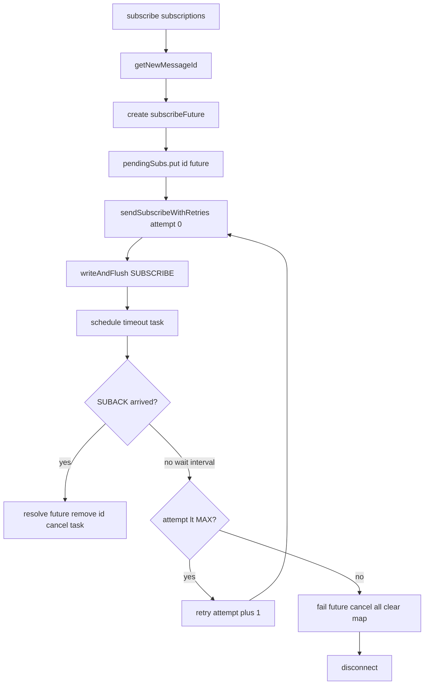

# Refactor: Subscribe with Retries using ConcurrentHashMap

## 1. Context and Motivation

`HmMq2tImpl` currently sends a SUBSCRIBE exactly once via `subscribe(...)` and relies on the periodic
`RetransmitTask` to re-send any unacknowledged message from `mqttAckMediator`. There is no bounded,
dedicated retry/timeout policy for a single subscription attempt, and the bookkeeping maps are
`synchronizedMap`-based.

Goal: give `subscribe(...)` a dedicated, bounded retry mechanism backed by a `ConcurrentHashMap` of
pending subscriptions, with an explicit timeout per attempt and a max retry count. After exhausting
retries, cancel pending futures and disconnect.

## 2. Current (broken) state of the file

The working copy contains a half-applied experiment that does **not compile**:

- Duplicate `subscribe(List<...>)` methods.
- Duplicate `unsubscribe(List<String>)` methods.
- `id` referenced in `subscribe()` before it is declared.
- `sendSubscribeWithRetries(...)` references out-of-scope `subscribeFuture` / `id`.
- Invalid `pendingSubs.foreach(f -> if (...) ...)` (should be `forEach` + block body).
- Extra `)` in `logger.info(...)` calls.
- Undefined constants: `PENDING_SUBSCRIBES`, `MAX_RETRY_SUB_ATTEMPTS`, `RETRY_INTERVAL_SECONDS`,
  `PENDING_UNSUBSCRIBE`, `MAX_RETRY_UNSUB_ATTEMPTS`.
- `TimeoutException` not imported.
- Name mismatch `PENDING_UNSUBSCRIBE` vs `PENDING_UNSUBSCRIBES`.

Any implementation must start from a clean baseline: remove the duplicate/broken experimental
methods and restore a compiling state, then apply the approved design.

## 3. Proposed Design

### 3.1 Data structure: pending subscriptions as a channel attribute

Store pending subscribe futures in a `ConcurrentHashMap` attached to the channel, keyed by the MQTT
packet identifier (message id).

```java
public static final AttributeKey<ConcurrentHashMap<Integer, Promise<MqttSubAckMessage>>> PENDING_SUBSCRIBES =
        AttributeKey.valueOf("pending_subscribes");

private static final int MAX_RETRY_SUB_ATTEMPTS = 3; // total attempts incl. the first
private static final long RETRY_INTERVAL_SECONDS = 5L;
```

Rationale:
- `ConcurrentHashMap` gives thread-safe `put`/`remove`/iteration without external locking, and is
  natural for concurrent completion (event loop + ack handler + timeout task).
- A channel `AttributeKey` scopes pending state to the current connection, so it is automatically
  discarded when the channel is closed/replaced after reconnect.

### 3.2 `subscribe(...)` flow

```
int id = getNewMessageId();
Promise<MqttSubAckMessage> subscribeFuture = new DefaultPromise<>(workerGroup.next());

ConcurrentHashMap<Integer, Promise<MqttSubAckMessage>> pendingSubs =
    channel.attr(PENDING_SUBSCRIBES).setIfAbsent(new ConcurrentHashMap<>()).get();
pendingSubs.put(id, subscribeFuture);

ScheduledFuture<?> scheduledTask = sendSubscribeWithRetries(subscriptions, id, subscribeFuture, 0);

subscribeFuture.addListener(f -> {
    if (scheduledTask != null) {
        scheduledTask.cancel(false); // stop timeout chain once the future is resolved/cancelled
    }
});

return subscribeFuture;
```

Notes:
- `id` and `subscribeFuture` are passed explicitly into `sendSubscribeWithRetries(...)` (they are not
  implicitly available inside the private helper).
- The promise is completed asynchronously by the SUBACK path (see 3.4).

### 3.3 `sendSubscribeWithRetries(subscriptions, id, subscribeFuture, attempt)`

```
build MqttSubscribeMessage using id
writeAndFlush(message)          // first/next attempt on the wire
log "Sent SUBSCRIBE id=..., attempt=..."

ScheduledFuture<?> task = channel.eventLoop().schedule(() -> {
    if (subscribeFuture != null && !subscribeFuture.isDone()) {
        log warn "Timeout SUBACK for id=... attempt=... is over"

        // clean this entry
        var pendingSubs = channel.attr(PENDING_SUBSCRIBES).get();
        if (pendingSubs != null) pendingSubs.remove(id);

        if (attempt < MAX_RETRY_SUB_ATTEMPTS - 1) {
            sendSubscribeWithRetries(subscriptions, id, subscribeFuture, attempt + 1);
        } else {
            log error "Broker did not answer for subscribe id=... after MAX_RETRY_SUB_ATTEMPTS"
            subscribeFuture.setFailure(new TimeoutException("...")); // optional early signal
            if (pendingSubs != null) {
                pendingSubs.forEach((k, f) -> { if (f != null && !f.isDone()) f.cancel(false); });
                pendingSubs.clear();
            }
            this.disconnect((byte) 1);
        }
    }
}, RETRY_INTERVAL_SECONDS, TimeUnit.SECONDS);

return task;
```

Logic:
- Every attempt re-sends the SUBSCRIBE (a fresh packet with the same `id`). Duplicate-id semantics:
  MQTT-3.8.4 allows a client to reuse the same packet id for a re-sent SUBSCRIBE only as a retry of
  the original; here each retry is a brand new SUBSCRIBE, so it is safer to allocate a **new** id per
  attempt. Decide: allocate `newId = getNewMessageId()` inside each attempt and update `pendingSubs`
  (remove old key, put new key), OR reuse the same `id`. Recommended: **new id per attempt** and
  re-key the map entry, to avoid broker-side duplicate-subscription semantics with the same packet id.
  This decision is flagged for review.
- The timeout task runs on the channel event loop so it is safe w.r.t. the channel lifecycle.
- On exhaustion: fail the current future, cancel all pending, clear the map, disconnect.

### 3.4 Completing the promise on SUBACK

The SUBACK arrives in `MqttSubscriptionHandler.channelRead` -> `handleSubAck`. Today it resolves the
future via `mqttAckMediator.getFuture(id)`:

```java
Promise<MqttSubAckMessage> future = mqttAckMediator.getFuture(id);
if (future != null) future.setSuccess(message);
```

Required integration (scope TBD):
- On SUBACK, resolve the promise from `PENDING_SUBSCRIBES` instead of (or in addition to)
  `mqttAckMediator`, i.e. look up by id, `setSuccess`, `remove(id)`.
- `HmMq2tImpl.handleSubAckMessage(...)` currently records granted QoS / failures into
  `subscribedTopics` and is wired as a listener on `subscribeFuture`. The listener approach must
  remain (the recording logic stays), but the source of truth for resolving the future shifts from
  `mqttAckMediator` to the `ConcurrentHashMap`.
- The `subscribedTopics` map itself can become a `ConcurrentHashMap` (currently
  `Collections.synchronizedMap(new LinkedHashMap<>())`). Ordering (LinkedHashMap) is lost with a
  plain `ConcurrentHashMap`; if insertion order matters for the "Active topics list" log, use a
  concurrent map or sort at output time. Flagged for decision.

### 3.5 Cleanup of unrelated broken code

- Remove the second `subscribe(...)` and the second `unsubscribe(...)` duplicates.
- Remove `sendUnsubscribeWithRetries(...)`, `PENDING_UNSUBSCRIBES` constant unless an analogous
  unsubscribe retry design is requested in the same change (out of scope for "refactor only
  subscribe").
- Restore `unsubscribe(...)` to its original working implementation.

## 4. Concurrency analysis

| Concern | Handling |
| --- | --- |
| Concurrent put/remove on pending map | `ConcurrentHashMap` |
| Timeout task vs SUBACK completing future | Promise is atomic; `isDone()` gate prevents double-completion; scheduled task cancelled on success |
| Reconnect replacing channel | attribute is per-channel; new channel gets a fresh empty map |
| Multiple concurrent subscriptions | unique ids from `getNewMessageId()`; map keyed by id |
| Disconnect from within timeout task | runs on event loop; `disconnect(...)` blocks briefly (`sleep(waitDisconnect)`) - flag for review |

## 5. Open decisions

1. New id per retry attempt vs reuse same id.
2. Keep `subscribedTopics` recording in `handleSubAckMessage` via future listener (recommended yes).
3. Convert `subscribedTopics` to `ConcurrentHashMap` and accept loss of insertion order, or preserve order (sort at log time).
4. Scope: subscribe-only (restore unsubscribe) vs symmetric subscribe+unsubscribe retries.
5. Whether `sendSubscribeWithRetries` may also be exposed for initial subscriptions after reconnect (`connect()` line `//subscribe(...)` is commented).

## 6. Proposed change set

- `HmMq2tImpl.java`: remove duplicate/broken methods; add `PENDING_SUBSCRIBES`,
  `MAX_RETRY_SUB_ATTEMPTS`, `RETRY_INTERVAL_SECONDS`; implement new `subscribe(...)` +
  `sendSubscribeWithRetries(...)`; adjust `handleSubAckMessage`/listener wiring; switch
  `subscribedTopics` to `ConcurrentHashMap` (if decision 3 = yes); add imports
  (`AttributeKey`, `ConcurrentHashMap`, `TimeoutException`).
- `MqttSubscriptionHandler.java` (if decision 4/design): resolve SUBACK future from
  `PENDING_SUBSCRIBES` map instead of `mqttAckMediator`.
- Unit/integration test covering: success, timeout->retry->success, timeout->max retries->disconnect.

## 7. Mermaid flow



## 8. Verification

- `./gradlew build` compiles.
- Manual: broker online -> subscribe succeeds; broker ignores SUBACK -> observe retries then
  disconnect after `MAX_RETRY_SUB_ATTEMPTS`.